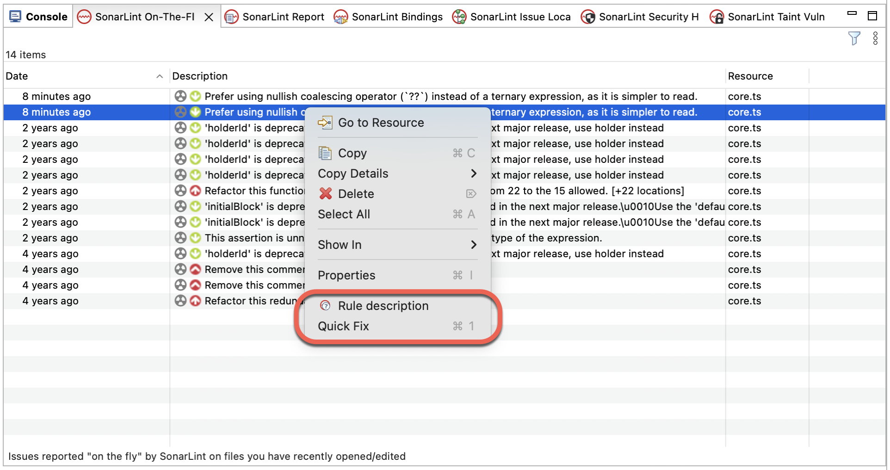

> ## ⓘ **Information**
>
>>**The content on this page has moved**: [**https://docs.sonarsource.com/sonarlint/eclipse/using-sonarlint/fixing-issues/**](https://docs.sonarsource.com/sonarlint/eclipse/using-sonarlint/fixing-issues/)
>
>The SonarLint documentation has a new home! Please visit [https://docs.sonarsource.com/sonarlint/eclipse/](https://docs.sonarsource.com/sonarlint/eclipse/) to check out the new documentation website. We’ve improved the documentation as a whole, integrated the four SonarLint IDE extension docs together, and moved everything under the sonarsource.com domain to share a home with the SonarQube docs (SonarCloud to come in Q3 of 2023).
>
>*These GitHub wikis will no longer be updated after September 1st, 2023* but no worries, we’ll keep them around for a while for those running previous versions of SonarLint for Visual Studio.
>
>

# Overview

Depending on the nature of your issue, SonarLint for Eclipse offers different fixes. Issues are usually presented in multiple locations and you can typically hover and/or click or right-click over these markers to open a tooltip that reveals your options. Check the Investigating issues page for more details about how to identify issues in the IDE.

## Preferences menu

Navigate to **Window** > **Preferences** > **SonarLint** (or **Eclipse** > **Settings…** > **SonarLint** for Mac OS) for access to the **SonarLint Preferences** menu. Here you will find 4 menus to:

* Pass additional properties to the SonarLint analyzers.
* Add/remove files to be excluded from the analysis.
* Agree/disagree to share anonymous telemetry statistics.
* And specifically define your rules configuration (when running in stand-alone mode).

### **Rule selection**

Sonar Rules can individually be turned on or off while running SonarLint in standalone mode; there are two ways to do this:

* Right-click on the issue and select the **Remove** rule quick fix in the tooltip.
* Activate and deactivate rules one by one in the **SonarLint Preferences** > **SonarLint** > **Rules Configuration** menu. A full list of rules organized by language is available.

When your project is bound to SonarQube or SonarCloud using Connected Mode, the rule set is managed on the server side as defined by the quality profile. See the [SonarQube](https://docs.sonarsource.com/sonarqube/latest/instance-administration/quality-profiles/) and [SonarCloud](https://docs.sonarcloud.io/standards/managing-quality-profiles/) documentation about quality profiles for more information.

## Quick fixes

Eclipse relies on the language support from the IDE to display quick fixes in different ways. Hovering over the issue in your code editor will reveal the SonarLint tooltip. Sonar Quick Fix options such as _Deactivate rule_ or _Insert placeholder comment_ will be shown when available. Depending on the language type and/or issue type, an action item such as _Show issue data flows_ or _Remove unused local variable_ will be offered. In addition, right-clicking an issue in the **SonarLint On-The-Fly** view will also reveal Quick Fix options.

You will always be offered the option in the tooltip and in all SonarLint view panels to open the issue’s rule in the **SonarLint Rule Description** view; the rule description explains why the issue is raised and details how to fix it. See Investigation issues for more details.

Sometimes your issue is recognized by additional analyzers. When this occurs, a full list of _all_ quick fixes will appear in the tooltip; SonarLint’s Quick Fixes are distinguishable by the SonarLint icon preceding the text title. 

## Fixing security hotspots and taint vulnerabilities

The use of Connected Mode is required to identify both security hotspots and taint vulnerabilities. Security hotspots require that your project be bound to SonarQube; Taint vulnerabilities can be found with a Connected Mode binding to either SonarQube or SonarCloud.

By default, a SonarLint hotspot badge and vulnerability padlock are displayed for _Security Hotspot_ and _Taint Vulnerability_ issues (respectively) in the Eclipse **Vertical ruler**. 

If you don’t see the data flow displayed in the code editor for taint issues, make sure that _code minings_ are enabled in the **Preferences > Java > Editor** > **Code Minings** menu.

Please have a look at the SonarLint documentation on Security hotspots and Taint vulnerabilities for more details about working with each issue type in SonarLint.

## Marking issues

When using SonarLint in Connected Mode it’s possible to change the resolution of issues to reclassify them SonarQube or SonarCloud. The requirements include: 

* Binding your project to a SonarQube instance or SonarCloud using Connected mode.
* You are granted the Administer Issues permission level by a project administrator.
* The issue already exists and is reported by SonarQube or SonarCloud.

Issues found on the server will have an additional SonarQube or SonarCloud icon shown in the SonarLint view, **Description** tab.

To change the resolution of an existing issue from the IDE:

* Right-click on an issue from one of the following SonarLint view windows: **On-The-Fly**, **Report**, or **Taint Vulnerabilities**. Then select **Mark Issue as…**.

Once selected, you can define the issue’s resolution as **Won’t Fix** or **False Positive** and add a comment if needed. The issue status will immediately be reflected on the SonarQube or SonarCloud server.
