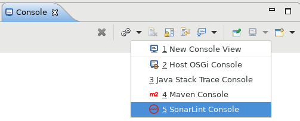
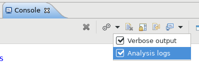
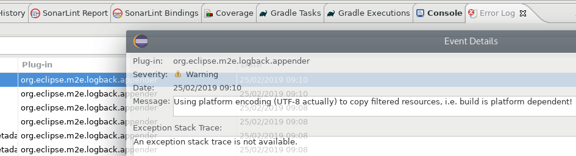

> ## ⓘ **Information**
>
>>**The content on this page has moved**: [**https://docs.sonarsource.com/sonarlint/eclipse/questions-and-feedback/**](https://docs.sonarsource.com/sonarlint/eclipse/questions-and-feedback/)
>
>The SonarLint documentation has a new home! Please visit [https://docs.sonarsource.com/sonarlint/eclipse/](https://docs.sonarsource.com/sonarlint/eclipse/) to check out the new documentation website. We’ve improved the documentation as a whole, integrated the four SonarLint IDE extension docs together, and moved everything under the sonarsource.com domain to share a home with the SonarQube docs (SonarCloud to come in Q3 of 2023).
>
>*These GitHub wikis will no longer be updated after September 1st, 2023* but no worries, we’ll keep them around for a while for those running previous versions of SonarLint for Visual Studio.
>
>

# FAQ/Troubleshooting

## How to get SonarLint for Eclipse logs?

1. Open the Eclipse `Console` view
2. Open the SonarLint Console

   

3. Enable `Verbose output` and `Analysis logs`

   

4. Reproduce the issue (e.g. reopen the offending file)

Sometimes errors are not in the SonarLint console, but could be directly in Eclipse error logs.

1. Open Eclipse `Error Log` view
2. Look for an error event related to SonarLint
3. Open event details to get the stacktrace 

   

## I have configured some SonarScanner properties. Are they applied to SonarLint?

No. Scanner properties you may have defined in `sonar-project.properties`, `pom.xml`, ... (like `sonar.sources`, `sonar.projectBasedir`, ...) only make sense in command line SonarScanner context.
SonarLint tries to use IDE metadata to avoid other configuration. 
If you want to share some configuration between SonarScanners and SonarLint, like exclusions, or some analyzer properties, the best way is to use connected mode and to set the configuration in the SonarQube or SonarCloud UI.

## How to ask for help?

There is a dedicated channel where you can get help for SonarLint: https://community.sonarsource.com/c/help/sl/

Before creating a new topic, please check if your question has already been answered.

When creating a new topic, please describe your issue with a maximum of details. Please provide if possible:

* IDE version and OS
* SonarLint version
* Are you using connected mode?
* If you are using connected mode, what is the SonarQube server version (or say if it is SonarCloud)
* If you are using connected mode, what are the installed analyzers. You can easily get a list by opening `https://<SQ server>/api/plugins/installed` in a web browser.
* The full stacktrace of the error. See previous section to enable verbose output
