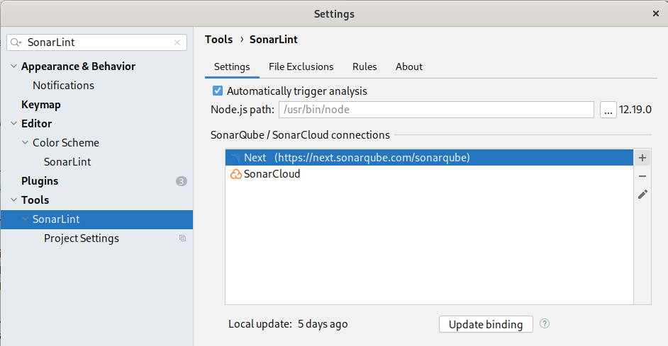
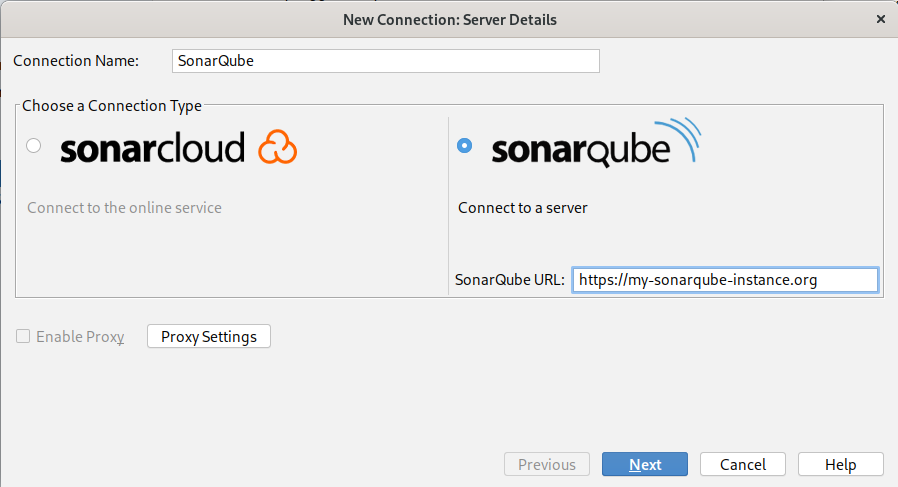
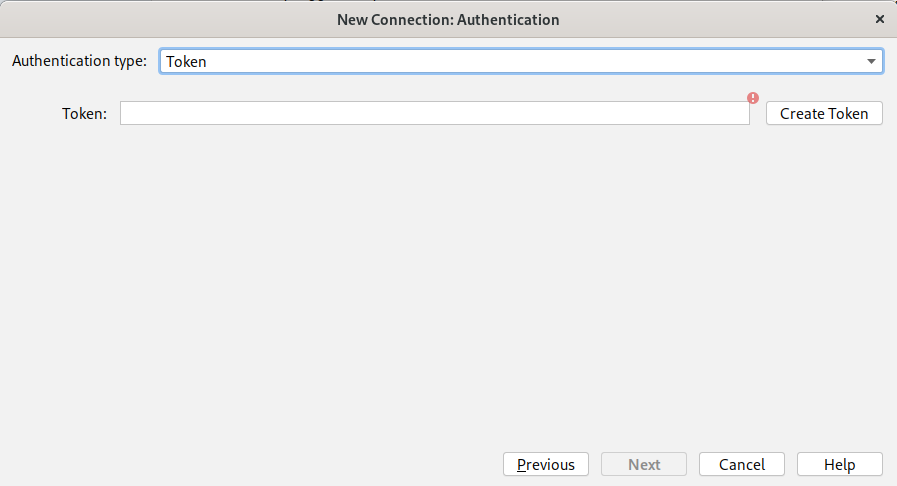
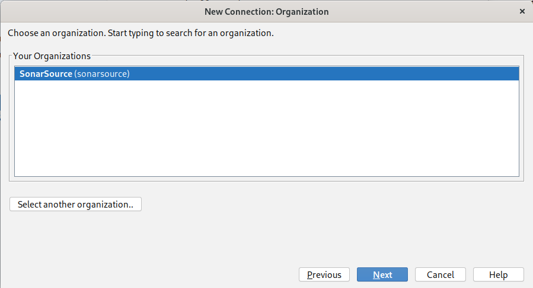
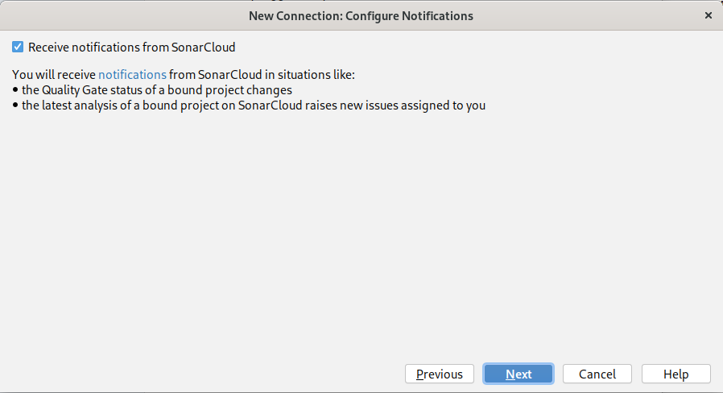
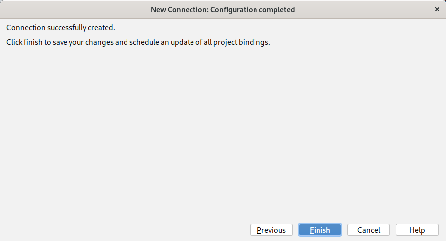
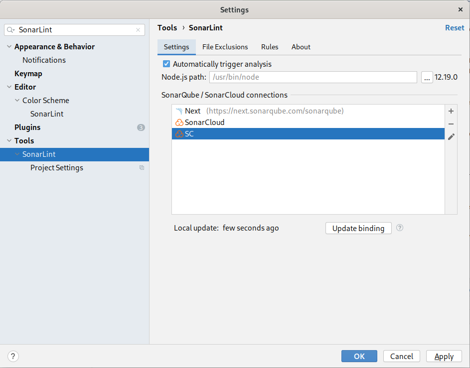
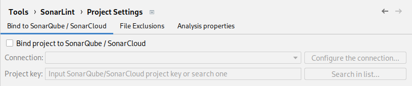
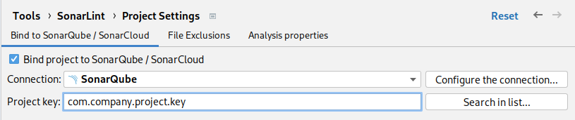
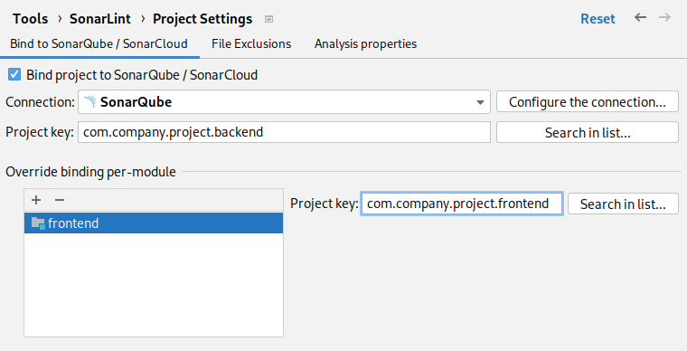

> ## ⓘ **Information**
>
>>**The content on this page has moved**: [**https://docs.sonarsource.com/sonarlint/intellij/team-features/connected-mode/**](https://docs.sonarsource.com/sonarlint/intellij/team-features/connected-mode/) 
>
>The SonarLint documentation has moved! Please visit [https://docs.sonarsource.com/sonarlint/intellij/](https://docs.sonarsource.com/sonarlint/intellij/) to have a look at the new documentation website. We’ve improved the documentation as a whole, integrated the four SonarLint IDE extension docs together, and moved everything under the sonarsource.com domain to share a home with the SonarQube docs (SonarCloud to come in Q3 of 2023).
>
>*These GitHub wikis will no longer be updated after September 1st, 2023* but no worries, we’ll keep them around a while for those running previous versions of SonarLint for IntelliJ.
>

# Overview
You can connect SonarLint to SonarQube >= 7.9 or SonarCloud to aim at having consistent issues reported on both sides.

Features when using Connected Mode:
* use the same quality profile (same rules activation, parameters, severity, ...)
* reuse some settings defined on the server (rule exclusions, analyzer parameters, ...)
* automatically suppress issues that are marked as _Won’t Fix_ or _False Positive_ on the server
* review a Security Hotspot by clicking on the 'Open in IDE' button on SonarQube
* display taint vulnerabilities that have been found on the server (there is currently no local detection of those advanced issues)
* use the same analyzers as the server, assuming they are supported in SonarLint (exception for C# and C/C++ analyzers where SonarLint keep using its embedded version)

Note: Connected Mode does not push issues to the server. Rather, its purpose is to configure the IDE so that it uses the same settings as the server.

# Configure a connection

A connection provides the set of information needed to communicate with the SonarQube server or SonarCloud (URL, credentials, ...).

1. Open IntelliJ settings, find the **Tools > SonarLint** entry, and select `+` to open the connection wizard:

   

2. Enter a name for this connection, select **SonarCloud** or **SonarQube**. For the latter, you will need to enter the server URL:

   

3. Choose the authentication method:
* Token: generate a user token on [SonarQube](https://docs.sonarqube.org/latest/user-guide/user-token/) or [SonarCloud](https://sonarcloud.io/documentation/user-guide/user-token/) for SonarLint to use as an authentication method. This is the preferred way to avoid the compromise of your username/password.
* Username + Password: this method can be used for a _SonarQube_ connection *only*. It lets you use your credentials directly (not recommended)

   

4. For _SonarCloud_ *only*, select the Organization that you want to connect to (you can also select a public one):

   

5. SonarQube and SonarCloud can push notifications to developers. You can decide whether or not to subscribe:

   

6. Validate the connection creation by selecting **Finish** at the end of the wizard:

   

7. Save the connection in global settings by clicking **OK**:

   

# Configure project binding

Once the connection is established, you can use it to bind your IDE project to a SonarQube/SonarCloud project.

1. Open IntelliJ settings, find the **Tools > SonarLint > Project Settings** entry:

   

2. Select **Bind project to SonarQube/SonarCloud** and choose the previously created connection name in the dropdown list
3. Enter the project key as it is configured on SonarQube/SonarCloud. You can also select it by using **Search in list...**:

   

## Override binding for modules

In IntelliJ additional modules can be imported into a project, e.g. via the 'Project Structure' menu.
This is often used for example to group together the back-end and the front-end parts of an application into the same project.
As those components might be analyzed separately, SonarLint lets users bind modules to different projects.

1. In the IntelliJ settings, find the **Tools > SonarLint > Project Settings** entry
2. Make sure a binding is configured at the project level (see the previous section). Note: this will be the default binding for all modules that have no overridden binding.
3. In the 'Override binding per module' section, click on the `+` sign and choose the module

   

# Connect to HTTPS server

TODO

# Troubleshooting

## I use Connected Mode but I observe different analysis results between SonarQube/SonarCloud and SonarLint

This can have different causes:

1. Third-party analyzers are not executed in _SonarLint_

   Some issues may be reported in _SonarQube_ by a plugin leveraging a third-party analyzer (PMD, Checkstyle, ESLint, PyLint, …). SonarLint will only run [rules from SonarSource analyzers](https://rules.sonarsource.com/) including [custom rules extending SonarSource analyzers](https://docs.sonarqube.org/latest/extend/adding-coding-rules/). Third-party analyzers usually have their own IDE integration, so we have no plan to run them in SonarLint.

2. SonarSource rules usually don’t report issues on test files

    Each SonarLint flavor has its own way of detecting which file is considered a test source (like a unit test). Most rules are not executed on test sources. See the IDE's specific section to know how SonarLint decides whether a file is _production code_ or _test code_.

3. “Second level” issues are not reported in SonarLint (rule keys starting by `common-xxx`)

    Issues that depend on the computation of code coverage or duplications are not reported by SonarLint. They are not compatible with “on the fly” analysis. Finding duplications requires the scanner to analyze the entire project (including sibling modules). Collecting coverage requires that all tests be executed with proper coverage engine configuration. This is currently outside the scope of SonarLint.

4. [Security Hotspots](https://docs.sonarqube.org/latest/user-guide/security-hotspots/) are not reported in SonarLint 

   They are not issues that can immediately be fixed. Security Hotspots follow a review process that is implemented on SonarQube / SonarCloud side.

5. Taint vulnerabilities are not reported in SonarLint

   [Vulnerabilities raised by the Taint Analyzer (SQL Injection, ...)](https://docs.sonarqube.org/latest/analysis/security_configuration/) are issues detected in SonarQube commercial editions that are also not detected by SonarLint (rule keys starting with `javasecurity`, `phpsecurity` or `roslyn.sonaranalyzer.security.cs`). Running tainted analysis in the IDE is currently not practical mainly for performance reason.

## Proxy issues

TODO