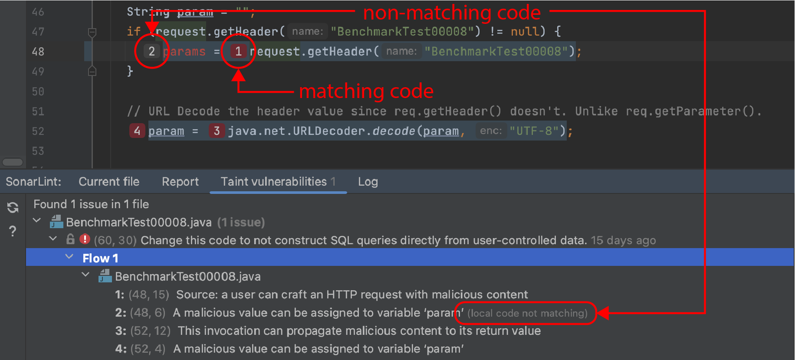
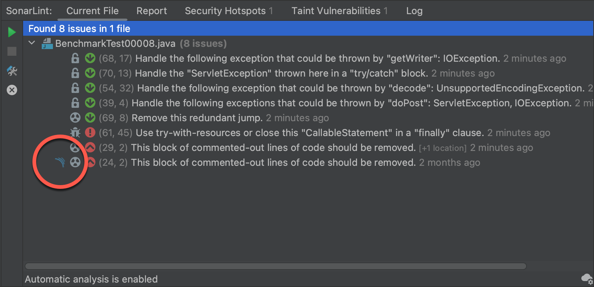

> ## ⓘ **Information**
>
>>**The content on this page has moved**: [**https://docs.sonarsource.com/sonarlint/intellij/using-sonarlint/fixing-issues/**](https://docs.sonarsource.com/sonarlint/intellij/using-sonarlint/fixing-issues/) 
>
>The SonarLint documentation has moved! Please visit [https://docs.sonarsource.com/sonarlint/intellij/](https://docs.sonarsource.com/sonarlint/intellij/) to have a look at the new documentation website. We’ve improved the documentation as a whole, integrated the four SonarLint IDE extension docs together, and moved everything under the sonarsource.com domain to share a home with the SonarQube docs (SonarCloud to come in Q3 of 2023).
>
>*These GitHub wikis will no longer be updated after September 1st, 2023* but no worries, we’ll keep them around a while for those running previous versions of SonarLint for IntelliJ.
>

# Overview

There are a few different ways to fix issues found by SonarLint for IntelliJ. Issues are most easily fixed by correcting the problem as it is described in the Sonar rule description but it’s not always that simple:

* Check the rule description to understand what the problem is.
* Check the locations tab to see where, if any other places the issue is found.

Double-click the issue in the SonarLint view window to jump to and highlight the code in the explorer. Once the code is highlighted, you have more than one way to expose solutions and suggested quick fixes.

## Quick fixes

Some issues have Sonar Quick Fixes which means that with a single click, SonarLint will automatically edit your source code to comply with the rule description; the fix might be applied on several lines in the file. While in the explorer window, type Alt+Enter, click the lightbulb in the left margin, or hover over the highlighted issue to reveal the tooltip exposing these options: 

1. **Fix the issue in the code**: Cmd / Ctrl + ↓ or double-click the issue report to jump to the line of code in the explorer window. 
2. **Disable the rule**: Go to your **IntelliJ Settings** > **Tools** > **SonarLint** > **Rules** and find the applicable rule per language. Some Sonar Rules are disabled by default because they overlap with the built-in IntelliJ code inspection; it doesn’t make sense to report the same issue twice. Note that when running in Connected Mode, rule configurations are fetched from the project’s quality profile and used by SonarLint, overriding any local configuration of your rule selection in the IDE.

## Fixing taint vulnerabilities

Issues shown in the **Taint vulnerabilities** tab are [security-related rule](https://docs.sonarqube.org/latest/user-guide/security-rules/) issues that are only raised by SonarQube (starting with Developer Edition) and SonarCloud. Due to technical limitations, SonarLint for IntelliJ can not raise such issues on local analysis. Taint vulnerabilities will not be shown in the **Current file** or **Report** tabs of the SonarLint view window unless you are running in [Connected Mode](https://github.com/SonarSource/sonarlint-intellij/wiki/Bind-to-SonarQube-or-SonarCloud). 

To investigate taint vulnerabilities when running in Connected Mode, double-click on the issue shown in the **Taint vulnerabilities** tab to open the location in the explorer (as you would with other issues). The tooltip and rule descriptions will reveal information about how to fix your issues. Please see the documentation about [Taint vulnerabilities](https://github.com/SonarSource/sonarlint-intellij/wiki/Taint-Vulnerabilities) for more information about working with these particular security issues.

### Understanding changes in your code

It could be that the local code does not match with the instance on the server. For example, when you are performing modifications, your code may be different than the server code as analyzed at the time when the issue was detected. In this case, the issue in the **Taint vulnerabilities** tab has a _local code not matching_ tag, signifying that your local code is a bit different than what it is on the server: the numbered inlay will be grey. In contrast, if the local code matches the issue on the server, it will have a numbered inlay in red.

The solution to managing differences in code depends on your goal at the time. It could be that you are actively updating your local branch in which case you should merge your branch with the main branch and re-run an analysis. It could be that your local branch is behind the main branch, in this case, you can click the **Refresh** button in the left margin of the SonarLint view window to pull an updated report from the server.

## Marking issues

When using SonarLint in Connected Mode it’s possible to change the resolution of issues to reclassify them in SonarQube or SonarCloud. The requirements include: 

* Binding your project to a SonarQube instance or SonarCloud using Connected mode.
* You are granted the Administer Issues permission level by a project administrator.
* The issue already exists and is reported by SonarQube or SonarCloud.

Issues found on the server will have an additional SonarQube or SonarCloud icon in SonarLint.

To change the resolution of an existing issue from the IDE:

* Right-click on an issue in the **Current File** or **Report** views, then select **Mark Issue as...**.
* Open the issue’s rule description in the **Rule** view window and select **Mark Issue as...**.
* From the IntelliJ Editor, select the issue and initiate an intention action, then select **Mark Issue as...**.

Once selected, you can define the issue’s resolution as **Won’t Fix** or **False Positive** and add a comment if needed. A confirmation is required to proceed and the issue status will immediately be reflected on the SonarQube or SonarCloud server.
