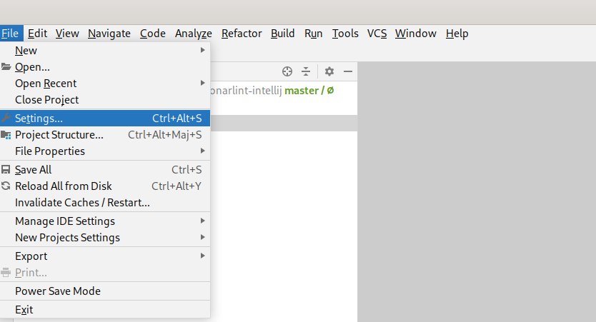

> ## ⓘ **Information**
>
>>**The content on this page has moved**: [**https://docs.sonarsource.com/sonarlint/intellij/getting-started/installation/**](https://docs.sonarsource.com/sonarlint/intellij/getting-started/installation/) 
>
>The SonarLint documentation has moved! Please visit [https://docs.sonarsource.com/sonarlint/intellij/](https://docs.sonarsource.com/sonarlint/intellij/) to have a look at the new documentation website. We’ve improved the documentation as a whole, integrated the four SonarLint IDE extension docs together, and moved everything under the sonarsource.com domain to share a home with the SonarQube docs (SonarCloud to come in Q3 of 2023).
>
>*These GitHub wikis will no longer be updated after September 1st, 2023* but no worries, we’ll keep them around a while for those running previous versions of SonarLint for IntelliJ.
>

# Installation

The easiest way to install the SonarLint plugin is to search the marketplace from the IDE.

Go to `File` > `Settings`:

   

Then select the `Plugins` > `Marketplace` tab:

   

Then click `OK` and restart the IDE to finalize the installation.

You can now enjoy SonarLint!

## Offline installation

In case you want to install SonarLint offline, you need to first get access to the plugin zip file.

You can download official versions on the marketplace from [this page](https://plugins.jetbrains.com/plugin/7973-sonarlint/versions). Sometimes an ad-hoc version can be built mainly for debugging purposes when a user reports a bug on our community forum.

To install the zip, you can go to `File` > `Settings` > `Plugins`, click on the wheel at the right, then `Install Plugin from Disk...`


   

# Supported languages

> ⓘ **NOTE**
>
>The content in this section now lives on the new [Rules page](https://docs.sonarsource.com/sonarlint/intellij/getting-started/installation/). 
>
---

| Language &nbsp; &nbsp; &nbsp; &nbsp; &nbsp; &nbsp;  | IntelliJ IDEA & Android Studio  | CLion   | Rider   | (DataGrip, Php Storm, PyCharm, RubyMine, and WebStorm)  |
| :-------- | :-----: | :-----: | :-----: | :-----: |
| [C#](https://rules.sonarsource.com/csharp) |  |  | ✅ |  |
| [C++](https://rules.sonarsource.com/cpp) |  | ✅ |  |  |
| [CSS](https://rules.sonarsource.com/css) | ✅ |  | ✅ | ✅ |
| [Go](https://rules.sonarsource.com/go) |  |  |  | ✅ (GoLand) |
| [HTML](https://rules.sonarsource.com/html) | ✅ |  | ✅ | ✅ |
| [Java](https://rules.sonarsource.com/java) | ✅ |  |  |  |
| [JavaScript](https://rules.sonarsource.com/javascript) | ✅ |  | ✅ | ✅ |
| [Kotlin](https://rules.sonarsource.com/kotlin) | ✅ |  |  | ✅ |
| [PHP](https://rules.sonarsource.com/php) | ✅ |  |  | ✅ |
| [Python](https://rules.sonarsource.com/python) | ✅ |  |  | ✅ |
| [Ruby](https://rules.sonarsource.com/ruby) | ✅ |  |  | ✅ |
| [TypeScript](https://rules.sonarsource.com/typescript) | ✅ |  | ✅ | ✅ |
| [XML](https://rules.sonarsource.com/xml) | ✅ |  |  | ✅ |

In addition, SonarLint for IntelliJ supports the IaC domains for: 

| Language  | IntelliJ IDEA & Android Studio  | CLion   | Rider   | (DataGrip, Php Storm, PyCharm, RubyMine, and WebStorm)  |
| :-------- | :---: | :---: | :---: | :---: |
| [CloudFormation](https://rules.sonarsource.com/cloudformation)| ✅ |  |  | ✅ |
| [Docker](https://rules.sonarsource.com/docker) | ✅ |  |  | ✅ |
| [Kubernetes](https://rules.sonarsource.com/kubernetes)| ✅ |  |  | ✅ |
| [Terraform](https://rules.sonarsource.com/terraform) | ✅ |  |  | ✅ |

You can unlock [Scala](https://rules.sonarsource.com/scala/), [Swift](https://rules.sonarsource.com/swift/), and [PL/SQL rules](https://rules.sonarsource.com/plsql/) when using [Connected Mode with SonarQube or SonarCloud](Bind-to-SonarQube-or-SonarCloud).

For more details about languages and new features under consideration for the JetBrains family IDEs, you can refer to the [SonarLint roadmap](https://portal.productboard.com/sonarsource/4-sonarlint/tabs/8-under-consideration) where we list all of our coming soon and newly released features.


# First taste of SonarLint

Let's analyze a first source file and see what SonarLint can bring.

Copy paste this Java code snippet in a project. It contains a code smell because of duplicated methods:

```java
package org.mycompany;

class MyClass {
  private static final String CODE = "XXX";

  public String calculateCode() {
    doTheThing();
    return CODE;
  }

  public String getName() {
    doTheThing();
    return CODE;
  }

  private void doTheThing() {
    // do it
  }
}

```

If you open this Java file within the editor, you should see SonarLint reporting the issue by highlighting the text range.

You can hover on the highlight to get a short description of the issue. Clicking on the lightbulb that appears in the left margin will reveal a tooltip containing one or more options, including the option to open a detailed Sonar Rule Description.

# Sonar Rule Descriptions

Simply select an issue in the SonarLint view or choose SonarLint: Show rule description from the tooltip to open the Rule tab. Here you will find a brief explanation of the rule as well as Noncompliant and Compliant code samples.


SonarLint for IntelliJ supports syntax highlighting. In addition, users are able to visualize a diff view for the non & compliant code sample which should help you fix your issue. Note that diff highlighting is only available for rules descriptions migrated to the [new format](https://community.sonarsource.com/t/sonarlint-for-intellij-7-3-better-help-for-taint-vulnerabilities-support-front-end-languages/79312), and we're progressively migrating all existing rules to the new format.