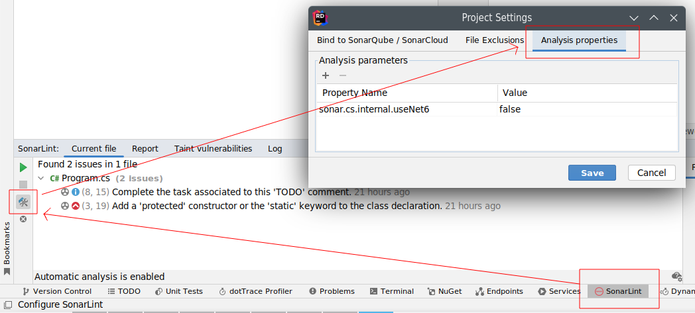

> ## ⓘ **Information**
>
>>**The content on this page has moved**: [**https://docs.sonarsource.com/sonarlint/intellij/using-sonarlint/scan-my-project/#supported-features-in-rider**](https://docs.sonarsource.com/sonarlint/intellij/using-sonarlint/scan-my-project/#supported-features-in-rider) 
>
>The SonarLint documentation has moved! Please visit [https://docs.sonarsource.com/sonarlint/intellij/](https://docs.sonarsource.com/sonarlint/intellij/) to have a look at the new documentation website. We’ve improved the documentation as a whole, integrated the four SonarLint IDE extension docs together, and moved everything under the sonarsource.com domain to share a home with the SonarQube docs (SonarCloud to come in Q3 of 2023).
>
>*These GitHub wikis will no longer be updated after September 1st, 2023* but no worries, we’ll keep them around a while for those running previous versions of SonarLint for IntelliJ.
>

# SonarLint in Rider

## Background

SonarSource C# analyzer is written as a Roslyn analyzer. We leverage [OmniSharp](https://github.com/OmniSharp/omnisharp-roslyn) project (the language server used by VSCode) as a "runner" for our analyzer.

## Supported Features

* Loading of C# projects type supported by VSCode C# (.NET Core, .NET Framework, Unity, ...) (but manual configuration may be required, see `sonar.cs.internal.useNet6` below)
* Analyze on the fly
* Analyze the entire solution (may be slow, as files are analyzed one at a time)
* Display of rules descriptions
* Setting up Connected Mode

## Missing features, known limitations

* We can't automatically determine the OmniSharp flavor to use for your project. You have to manually set `sonar.cs.internal.useNet6` to `false` for legacy or Mono projects (see [Advanced Configuration](#advanced-configuration)).
* No VB.NET support (let us know if you are interested)
* Big solutions can take a lot of time to load/consume a lot of resources (see [Advanced Configuration](#advanced-configuration) section)
* If you have a `~/.omnisharp/omnisharp.json` configuration file, it will conflict with SonarLint. Please remove it.
* Solutions mixing "new" and "legacy" projects are partially supported. Depending on the value of `sonar.cs.internal.useNet6` (see [Advanced Configuration](#advanced-configuration)), only the supported projects will be loaded and have issues reported

## Advanced configuration

We aim at making SonarLint easy to use, and smart enough to avoid manual configuration. Unfortunately, we are not there yet for Rider. So here are a few properties you can set to tune embedded OmniSharp behavior:
| Analysis Property  | Default value | Description |
| ------------- | ------------- | ------------- |
| `sonar.cs.internal.useNet6`  | `true`  | Use the modern Net 6 build of OmniSharp. If you are working with a Mono solution on Linux/Unix, or with an old NET Framework solution on Windows (< 4), set it to `false` |
| `sonar.cs.internal.loadProjectsOnDemand`  | `false`  | By default the all projects of the solution will be loaded. This ensure maximum rules accuracy. For very big solutions that take too long to load, change this to `true`. |
| `sonar.cs.internal.startupTimeout`  | `60`  | Maximum waiting time (in seconds) for OmniSharp to start |
| `sonar.cs.internal.loadProjectsTimeout`  | `60`  | Maximum waiting time (in seconds) for OmniSharp to load all projects (not relevant if `sonar.cs.internal.loadProjectsOnDemand` is set to `true`) |

To define those properties, go to **SonarLint Project Settings**:

## Reporting issues

We are interested in your [feedback](https://community.sonarsource.com/c/sl/fault/6). In case of an issue, please share:
* Your version of Rider:
* Your project/solution target and type (.NET Core, .NET Framework, ASP, Unity, ...):
* The version of SonarLint you installed:
* SonarLint + OmniSharp logs: in the SonarLint console, you have to [enable verbose/analysis logs](Troubleshooting):