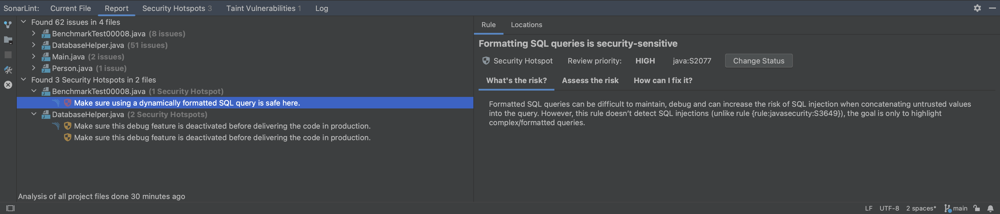
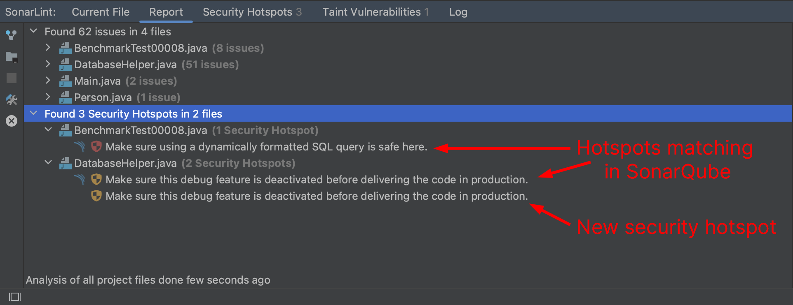

> ## ⓘ **Information**
>
>>**The content on this page has moved**: [**https://docs.sonarsource.com/sonarlint/intellij/using-sonarlint/security-hotspots/**](https://docs.sonarsource.com/sonarlint/intellij/using-sonarlint/security-hotspots/)  
>
>The SonarLint documentation has moved! Please visit [https://docs.sonarsource.com/sonarlint/intellij/](https://docs.sonarsource.com/sonarlint/intellij/) to have a look at the new documentation website. We’ve improved the documentation as a whole, integrated the four SonarLint IDE extension docs together, and moved everything under the sonarsource.com domain to share a home with the SonarQube docs (SonarCloud to come in Q3 of 2023).
>
>*These GitHub wikis will no longer be updated after September 1st, 2023* but no worries, we’ll keep them around a while for those running previous versions of SonarLint for IntelliJ.
>

# Overview

A security hotspot highlights a security-sensitive piece of code that the developer needs to review. Upon review, you'll either find there is no threat or you need to apply a fix to secure the code. For more information about Security Hotspots, take a look at the [SonarQube](https://docs.sonarqube.org/latest/user-guide/security-hotspots/) and [SonarCloud](https://docs.sonarcloud.io/digging-deeper/security-hotspots/) documentation.

In SonarLint for IntelliJ, local detection of Security Hotspots is enabled if you are using [Connected Mode](/Bind-to-SonarQube-or-SonarCloud.md) with a project on SonarQube 9.7+ or SonarCloud.​

## Reviewing hotspots

First, open a file while your project is running in Connected Mode with SonarQube 9.7+ or SonarCloud. SonarLint will automatically run an analysis to look for security hotspots, then compare local results against those on the server.

All security hotspot results are presented in the **Security Hotspots** tab of the SonarLint view window. Detected hotspots will be categorized by High, Medium, or Low review priority as noted by their icon. Hotspots found both locally and on the SonarQube or SonarCloud server. Hotspots found locally that are matched to those found on the server are identified by an additional SonarQube or SonarCloud icon. There is a filter in the left sidebar to **Show All**, show **Local Only**, or show only hotspots **Existing on SonarQube** or **SonarCloud**.

As with all issues found by SonarLint, double-clicking an issue in the SonarLint view window highlights the code in the code editor. Selecting a hotspot will automatically open the rule description where you have a chance to investigate further.

## Ways to find hotspots

With SonarLint for IntelliJ, it is possible to analyze and detect security hotspots in all project files:

- Select the **Analyze All Project Files** icon in the **Report** tab.
- Select the **Analyze VCS Changed Files** icon to analyze files changed since the last commit.
- Right-click on a selection of files in the explorer window and select **SonarLint** > **Analyze with SonarLint** to populate issues in the **Report** tab for review. In the **Report** tab, security hotspots are displayed separately from regular issues and are grouped by file.

## Investigating hotspots

### New hotspots 
New security hotspots are those not yet detected by a SonarQube or SonarCloud analysis and have only one hotspot icon that identifies its review priority. These hotspots can be fixed by modifying the code or submitting your code to trigger a new analysis on the server-side. 

### Matching hotspots in SonarQube

After each local analysis is complete, SonarLint compares the local results against those found on the SonarQube or SonarCloud server; hotspots found in both places will have an additional SonarQube or SonarCloud icon. Once synced with the server, you can mark the security hotspot as **Safe** or **Fixed** in the IDE; see [Fixing hotspots](#Fixing-hotspots) for more detail.

Marking the hotspot as **Safe** or **Fixed** on the server and re-running a local analysis will update the review status in the IDE.

If you prefer to manage the security hotspot on the server, right-click on the hotspot and select **Open in SonarQube** or **SonarCloud**; the hotspot will open in your default browser. Don’t forget that there’s a filter in the left sidebar of the **Security Hotspots** view to help you sort hotspots.

## Fixing hotspots

How you fix a security hotspot depends on your assessment of the risk. Check the Rule description and the **How can I fix it?** tab to find recommended secure coding practices and compliant solutions (when available). More information can be found in the [SonarQube](https://docs.sonarqube.org/latest/user-guide/security-hotspots/) and [SonarCloud](https://docs.sonarcloud.io/digging-deeper/security-hotspots/) documentation. 

Once you determine the risk, you can either update your code locally, or if the hotspot matches one found on the server, change the hotspot’s review status in the IDE from **To Review** to **Fixed**, or **Safe**. Prerequisites to change the review status in the IDE are:

- The security hotspot detected locally is already known by SonarQube or SonarCloud.
- You are granted the _Administer Security Hotspot_ permission level by a project administrator. 

Simply select the hotspot in either the **Report** or **Security Hotspots** view window to open its **Rule Description**. In the **Rule** tab, click the **Change Status** button to open a dialog box where you can mark it **To review**, **Fixed**, or **Safe** from the IDE. 