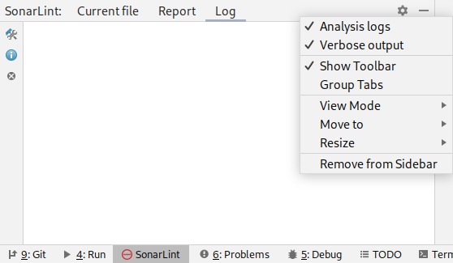

> ## ⓘ **Information**
>
>>**The content on this page has moved**: [**https://docs.sonarsource.com/sonarlint/intellij/troubleshooting/**](https://docs.sonarsource.com/sonarlint/intellij/troubleshooting/) 
>
>The SonarLint documentation has moved! Please visit [https://docs.sonarsource.com/sonarlint/intellij/](https://docs.sonarsource.com/sonarlint/intellij/) to have a look at the new documentation website. We’ve improved the documentation as a whole, integrated the four SonarLint IDE extension docs together, and moved everything under the sonarsource.com domain to share a home with the SonarQube docs (SonarCloud to come in Q3 of 2023).
>
>*These GitHub wikis will no longer be updated after September 1st, 2023* but no worries, we’ll keep them around a while for those running previous versions of SonarLint for IntelliJ.
>

# FAQ/Troubleshooting

## How to get SonarLint for IntelliJ logs?

1. Open the SonarLint tool window: **View** > **Tool Windows** > **SonarLint**.
2. Enable the **Verbose output** and **Analysis logs** options in the tool window settings.

   

3. Find the logs in the **Log** tab of the tool window.

## How to access thread dumps?

In some cases, it can be useful to extract thread dumps from the running instance of IntelliJ for debugging; thread dumps often help us investigate UI freeze issues or threading problems. [This article](https://intellij-support.jetbrains.com/hc/en-us/articles/206544899-Getting-a-thread-dump-when-IDE-hangs-and-doesn-t-respond) from JetBrains will help you find or generate those dumps.

If the UI is still reactive, you have another alternative: select **Help** > **Collect Logs and Diagnostic Data** to create a .zip file containing one or several `threadDumps-XXX` folders. In these folders, you should find one .txt file with the current date and time that will contain the logs.

## I have configured some SonarScanner properties. Are they applied to SonarLint?

No. Scanner properties you may have defined in the `sonar-project.properties` or `pom.xml` files (for example `sonar.sources` or `sonar.projectBasedir`) only make sense when modifying the SonarScanner in the command line. SonarLint tries to use IDE metadata to avoid other configurations. 

If you want to share some configuration between SonarScanners and SonarLint, like exclusions, or some analyzer properties, the best way is to use Connected Mode and set the configuration in the SonarQube or SonarCloud UI

## How to ask for help?

There is a dedicated channel where you can get help for SonarLint: https://community.sonarsource.com/c/help/sl/

Before creating a new topic, please check if your question has already been answered.

When creating a new topic, please describe your issue with a maximum of details. Please provide if possible:

* IDE flavor/version/OS. Example: IntelliJ Community Edition 2020.3 on MacOSX:
* SonarLint version:
* Are you using connected mode? Y/N:
* If you are using Connected Mode, what is the SonarQube server version (or say if it is SonarCloud):
* If you are using Connected Mode, what are the installed analyzers? You can easily get a list by opening `https://<SQ server>/api/plugins/installed` in a web browser:
* The full stacktrace of the error. See previous section to enable verbose output:
