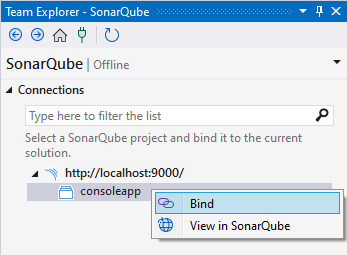

> ## ⓘ **Information**
>
>>**The content on this page has moved**: [**https://docs.sonarsource.com/sonarlint/visual-studio/team-features/connected-mode/**](https://docs.sonarsource.com/sonarlint/visual-studio/team-features/connected-mode/)  
>
>The SonarLint documentation has moved! Please visit [https://docs.sonarsource.com/sonarlint/visual-studio/](https://docs.sonarsource.com/sonarlint/visual-studio/) to have a look at the new documentation website. We’ve improved the documentation as a whole, integrated the four SonarLint IDE extension docs together, and moved everything under the sonarsource.com domain to share a home with the SonarQube docs (SonarCloud to come in Q3 of 2023).
>
>*These GitHub wikis will no longer be updated after October 1st, 2023* but no worries, we’ll keep them around a while for those running previous versions of SonarLint for Visual Studio.
>

# Overview
You can connect SonarLint to SonarQube 8.9+ or SonarCloud to benefit from the same rules and settings that are used to inspect your project on the server. SonarLint then hides in VS the issues that are marked as **Won’t Fix**, **False Positive**, or **Fixed**.

Note: Connected Mode does not push or pull issues to or from the server. Rather, its purpose is to configure the IDE so that it uses the same settings as the server.

## Prerequisites and supported languages

Having a SonarQube 8.9+ project or a SonarCloud project is required to run SonarLint for Visual Studio in Connected Mode. The following languages and Visual Studio project types are supported:

* [C# rules](https://rules.sonarsource.com/csharp) (.csproj)
* [VB.NET rules](https://rules.sonarsource.com/vbnet) (.vbproj)
* [C++ rules](https://rules.sonarsource.com/cpp) (*.vxcproj and CMake)
* [CSS rules](https://rules.sonarsource.com/css) (from SonarLint for Visual Studio v6.16)
* [JavaScript rules](https://rules.sonarsource.com/javascript) and [TypeScript rules](https://rules.sonarsource.com/typescript) in MSBuild projects or folder workspaces (from SonarLint for Visual Studio v6.7)

When running SonarLint in Connected Mode with SonarQube, Security Hotspots found in JS and CFamily files will be reported. See the [Security Hotspot Investigation](https://github.com/SonarSource/sonarlint-visualstudio/wiki/Security-Hotspots-Investigation) page for more details.

## Branch awareness

SonarLint’s branch awareness attempts to find the best matching branch from the server to align your code with the most recent analysis and works automatically when running in Connected Mode. 

SonarLint will automatically detect when the local git branch changes; and it will recalculate the closest Sonar branch in the background to know which taint issues and suppressions to fetch from the server (for example, issues marked as “safe” or “won’t fix” in SonarQube).

SonarLint for Visual Studio only supports git and the git branch name with regard to branch matching. If the SonarLint’s branch awareness algorithm fails to detect a best match, taint vulnerabilities and issue suppressions will be pulled from the Sonar main branch by default.

# Connection Setup
#### Step 1 
In Visual Studio, go to **Extensions** > **SonarLint** > **Connected mode** and select **Bind to SonarQube or SonarCloud…**, this will open the **SonarQube Connections** tab.

**NOTE**: Although the tab reads SonarQube, it is used for connecting to both SonarQube and SonarCloud.

#### Step 2 
Click **Connect…** to open the connection dialog box.

The **Connect to a SonarQube server** dialog box tab is used for connecting to both SonarQube and SonarCloud.

#### Step 3 
In the **SonarQube Server** field:
* If you’re connecting to SonarQube: enter your SonarQube server address.
* If you’re connecting to SonarCloud: enter your SonarCloud server URL that starts with `https://sonarcloud.io`

#### Step 4 
In the **Username/Token** field, enter a [SonarQube](https://docs.sonarqube.org/latest/user-guide/user-account/generating-and-using-tokens/) or [SonarCloud](https://docs.sonarcloud.io/advanced-setup/user-accounts/#user-tokens) user token and leave the **Password** field blank

#### Step 5
Click **Connect** to set up the connection.

#### Step 6
(for SonarCloud only) Select the organization you want to bind to and click **OK**. To bind to a third-party organization that is not on the list, go to Other organizations and enter the [organization key](https://docs.sonarcloud.io/appendices/project-information/).

The SonarQube tab now displays your projects; you will also see your organization if you are connected to SonarCloud.

# Extended Rule descriptions
From v6.14 and newer, Extended rule descriptions written in SonarQube or SonarCloud are available in the **Sonar Rule Help** view container. Because they are written SonarQube or SonarCloud, you must be viewing your project while in Connected Mode.

* You can extend rule descriptions in [SonarQube](https://docs.sonarqube.org/latest/user-guide/rules/overview/#rule-details) and [SonarCloud](https://docs.sonarcloud.io/digging-deeper/rules/#rule-details) to let users know how your organization uses a particular rule or give more insight into a rule.
* Note that the extension will be available to non-admin users as a normal part of the rule details.

In your SonarQube or SonarCloud instance, go to the Rule you want to edit in the **Rules** tab, then click the **Extend Description** button to open a field box that will accept your Markdown-formatted text. What you add to the rule from your SonarQube or SonarCloud server will be seen in the user’s instance of Visual Studio.

# Project binding
When you bind a project, SonarLint uses the Quality Profile defined on the server to decide which rules to run locally, and which rule parameters to use. When you mark a particular issue as “safe” or “won’t fix” on the server, the corresponding issue will be ignored in the IDE. Check the [SonarQube](https://docs.sonarqube.org/latest/instance-administration/quality-profiles/) or [SonarCloud](https://docs.sonarcloud.io/standards/managing-quality-profiles/) documentation for details about managing your quality profile. 

The Connected Mode binding settings are written under %AppData%\Roaming\SonarLint for Visual Studio\Bindings. Each bound solution will have its own folder.

To bind a project, go to Visual Studio **Team Explorer** > _Your SonarQube instance_ and double-click the project you want to bind; alternatively, you can right-click on your project and select **Bind**.To unbind a project, see the [instructions below](#unbinding-a-project).

To bind a project, go to the **Team Explorer** > *Your SonarQube instance* and double-click the project you want to bind; alternatively, you can right-click on your project and select **Bind**.

SonarLint automatically fetches the required settings from the server and creates local configuration files. To manually trigger an update, go to Visual Studio **Team Explorer** > **SonarQube**, right-click the project whose binding you want to update, and select **Update**.

## Additional notes for Tfvc users
If you are using Team Foundation Version Control **and** have C# or VB.NET projects in your solution it is possible that you will see some additional dialogs from Tfvc appearing when binding finishes. If your solution does not contain C# or VB.NET projects you can disregard the rest of this section.

Tfvc might pop up one or more dialogs like the one below warning that files outside the workspace are being referenced and asking for confirmation that this is ok. These files are used to configure analysis for C# and VB.NET, and do not need to be under source control. Click `Add the item` to dismiss the dialog.

Once you have dismissed the Tfvc dialogs they should not appear again.

## Synchronization with the server

## Local settings

When you open a bound solution in Visual Studio, SonarLint automatically checks if the server configuration has changed. While you code, SonarLint supports near-real time sync of suppressed issues; in this way, issue statuses and quality profile changes made on the server are automatically updated in your local environment.

If you are running SonarLint for Visual Studio v6.16 or earlier, please see the Previous versions page for information about server synchroniyation was managed.

### Types of updates

#### **Quality Profiles**

Quality profiles are a key part of using SonarLint in Connected Mode with [SonarQube](https://docs.sonarqube.org/latest/instance-administration/quality-profiles/) or [SonarCloud](https://docs.sonarcloud.io/standards/managing-quality-profiles/). SonarLint periodically syncs the project’s quality profile from the server and applies its set of [rules](https://rules.sonarsource.com/) during code analysis.  \

#### **Suppressed issues**

As mentioned above, it is rare that you will need to manually retrieve suppressed issues from the server because SonarLint automatically fetches them when the bound solution is opened. From v6.14, SonarLint supports near-real-time sync of suppressed issues; note that previous releases periodically check for updates every 10 minutes, when a bound solution is opened, or the git branch changes in the IDE.

Issue suppressions are reapplied automatically.

NOTE: A suppressed issue might still appear in Visual Studio if the code is different from when it was analyzed on SonarQube/SonarCloud.

#### **File exclusions**

SonarLint fetches file exclusions from the SonarQube or SonarCloud server when you bind a project or update a binding, and saves them to a file named sonar.settings.json. For more information about how the SonarLint settings are handled by the server, see the [SonarQube](https://docs.sonarqube.org/latest/project-administration/narrowing-the-focus/) or [SonarCloud](https://docs.sonarcloud.io/advanced-setup/analysis-scope/) documentation on setting your analysis scope.

Note that in In SonarLint for Visual Studio 7.0, the settings file was moved outside of the solution directory; please check the [Legacy connected mode](#legacy-connected-mode) article below for information about the settings file in versions 6.16 and older.

Known limitations for file exclusions:

* Supported Languages: C# & VB (.NET support in SonarLint v6.15+), C, C++, CSS, JavaScript, TypeScript, and Secrets.
* Patterns should start with `**/`
* Multicriteria and Test exclusions are not supported. SonarLint for Visual Studio only supports Global Source File Exclusions, Source File Exclusions, and Source File Inclusions when setting the analysis scope. See the pages about file inclusion and exclusion on [SonarQube](https://docs.sonarqube.org/latest/project-administration/narrowing-the-focus/#file-exclusion-and-inclusion) and [Sonarcloud](https://docs.sonarcloud.io/advanced-setup/analysis-scope/#file-exclusion-and-inclusion) in their documentation.

# Unbinding a project
It is not possible to unbind a project from the Visual Studio UI however, this feature is on the Team's backlog. Nevertheless, it is possible to manually remove a solution from Connected Mode:

* Delete the bindings folder associated with your project: Each bound solution will have a separate folder under that is located in the \%AppData%\SonarLint for Visual Studio\Bindings folder; delete the associated project folder.

# Legacy connected mode

Before SonarLint for Visual Studio version 7.0 (released in June 2023), Connected Mode behaved a bit differently:

* In versions 6.16 and earlier, SonarLint saved all of its configuration files *inside the solution project folder*, and it was up to the user to commit or exclude the Sonar settings. This caused some version control management problems, especially when syncing with the server in Connected Mode. Please check the [Previous versions](https://github.com/SonarSource/sonarlint-visualstudio/wiki/Previous-versions) page for important details when running in Connected Mode.
* From version 7.0 and newer, the settings folder was moved outside of the solution directory to the %AppData%\Roaming\SonarLint for Visual Studio\Bindings folder.

Before SonarLint for Visual Studio version 4.0 (released in May 2018), Connected Mode behaved a bit differently:
* The appropriate NuGet package for the `SonarAnalyzer.CSharp/SonarAnalyzer.VisualBasic` analyzers were added to each project.
* The Connected Mode settings were saved in a solution-level folder called SonarQube in a file called `SolutionBinding.sqconfig`.
* If you are upgrading to version 7.0 from Sonarlint version 3.10 or earlier, please check the [Migrating from a legacy version](https://github.com/SonarSource/sonarlint-visualstudio/wiki/Migrate-Connected-Mode-to-v7#migrating-from-a-legacy-version) paragraph for instructions.

In SonarLint for Visual Studio version 4.0 and later:
* The analyzer NuGet packages are no longer installed in any project
* The settings are saved in a solution-level folder called `.sonarlint` in a file called `[solution name].slconfig`. 

# Known issues 
The goal is to have the same issues reported in the IDE as are reported on the server. However, there are a number of reasons why a set of issues can be different: some technical, some bugs, or some work that just hasn't been done yet.

See ticket [#1336](https://github.com/SonarSource/sonarlint-visualstudio/issues/1336) for a summary of the known issues and their current status.
