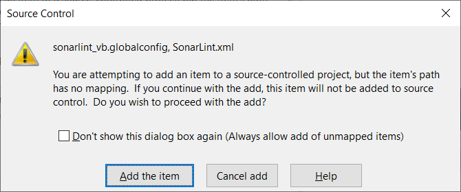

> ## ⓘ **Information**
>
>>**The content on this page has moved**: [**https://docs.sonarsource.com/sonarlint/visual-studio/team-features/migrate-connected-mode-to-v7/**](https://docs.sonarsource.com/sonarlint/visual-studio/team-features/migrate-connected-mode-to-v7/)  
>
>The SonarLint documentation has moved! Please visit [https://docs.sonarsource.com/sonarlint/visual-studio/](https://docs.sonarsource.com/sonarlint/visual-studio/) to have a look at the new documentation website. We’ve improved the documentation as a whole, integrated the four SonarLint IDE extension docs together, and moved everything under the sonarsource.com domain to share a home with the SonarQube docs (SonarCloud to come in Q3 of 2023).
>
>*These GitHub wikis will no longer be updated after October 1st, 2023* but no worries, we’ll keep them around a while for those running previous versions of SonarLint for Visual Studio.
>

# Overview

SonarLint for Visual Studio 7.0+ no longer stores the Connected Mode settings files in a location that could be under source control, and no longer modifies C# and VB.NET project files to configure the analysis rules.

This makes binding a solution for the first time much simpler because no source-controlled files will be modified. However, any solutions that were bound using the old configuration model will need to have their configuration settings migrated to the new model.

## Migration is required to re-enable Connected Mode features
Any features that require a connection to the Sonar server will not be available until you have migrated to the new model, including the following:
* issues suppressed on the server will not be suppressed in the IDE
* changes to Quality Profiles will not be synchronized to the IDE
* taint issues reported on the server will not be shown in the IDE

Analysis will still be performed using the using old-style analysis configuration that is part of the solution (but without suppressions).

# Automating the migration process

To help automate the migration process, SonarLint for Visual Studio 7.0 provides a migration wizard. 

* If you did not customize your binding settings in earlier versions, the wizard should be able to complete the migration without error.
* If you did customize your binding settings, you might need to manually undo your changes. 
* If you are upgrading from a legacy version of Sonarlint (version 3.10 or earlier), please skip directly to the [Migrating from a legacy version](#migrating-from-a-legacy-version) header below for instructions.

It is recommended to first run the wizard; once completed, SonarLint will announce whether or not the migration was successful. Please check the [instructions below](#if-the-wizard-cannot-make-changes-automatically) about what to do with the wizard logs if there is an error.

# Using the migration wizard

When you open a solution that is bound using the old model, SonarLint will display a notification in Visual Studio and offer an option to open a wizard to help with migration.

Before starting the wizard, it is **_highly recommended_** that you begin in a clean state. For example, you should have no unsaved files, and no uncommitted changes to files under source control before starting the migration.

Select **Migrate configuration** to start the Connected Mode migration wizard. The wizard will do the following:

* Delete the existing .sonarlint settings folder.
    * Note: this may cause source control changes.

* Write the settings files in the new location.

In addition, **_for C# and VB.NET projects only_**, the migration wizard will attempt to do the following:

* Remove any <AdditionalFiles> entries that point to the SonarLint-generated SonarLint.xml file.

* Remove any <CodeAnalysisRuleSet> MSBuild properties that point to the SonarLint-generated ruleset.

SonarLint will attempt to remove these settings from the project files themselves, and also from any .props or .targets files it finds.

SonarLint will announce whether or not the migration was successful. If SonarLint cannot remove all of the settings automatically, it will do its best to identify any changes that must be made manually.

If your code is under source control, you can review the diff after the wizard has finished and see what was changed. Once complete, commiting the change to source control will complete the migration process.

# If the wizard cannot make changes automatically

If the wizard cannot make changes automatically, use the logs to identify which what was missed. Then, manually locate and remove the setting. 

To manually remove the setting, you will need to:

1. delete the .sonarlint folder, and
1. remove the relevant settings from C# and VB.NET project files. See this page for more information about the settings that need to be removed.

Once complete, commit the change to source control to complete the process.

If you have problems with the migration, please open a thread in the [Visual Studio Community Forum](https://community.sonarsource.com/tags/c/sl/visual-studio/35/connected_mode) and tag it with the tags `connected_mode` and `migration`.

# Migrating from a legacy version

If you are upgrading from a legacy version of Sonarlint for Visual Studio (version 3.10 or earlier), the migration must be done manually. In addition to the deletion of all SonarLint-related folders as described above (in [If the wizard cannot make changes automatically](#if-the-wizard-cannot-make-changes-automatically)), you must delete the SonarQube folder from the project before binding again to SonarQube or SonarCloud.

# Additional notes for Tfvc users
If you are using Team Foundation Version Control **and** have C# or VB.NET projects in your solution it is possible that you will see some additional dialogs from Tfvc appearing when the migration finishes. If your solution does not contain C# or VB.NET projects you can disregard the rest of this section.

As described above, the settings files are no longer written to a source-controlled location. Instead, they are written under the per-user roaming folder (`%APPDATA%\SonarLint for Visual Studio`). However, the projects still need to reference the settings files that configure the Roslyn-based Sonar C# and VB.NET rules.

Tfvc will detect that these files are being referenced and may pop up one or more dialogs like the one below warning that files outside the workspace are being referenced and asking for confirmation that this is ok. Click `Add the item` to dismiss the dialog.

It is possible that multiple Visual Studio dialogs will appear, or that they will appear behind the migration wizard dialog. In that case, you might need to dismiss the wizard dialog before the Visual Studio dialogs can be closed. The wizard dialog can be closed by the `Enter` or `Escape` keys, or using the mouse.

Once you have dismissed the Tfvc dialogs they should not appear again.
