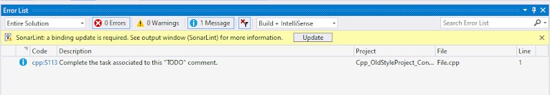
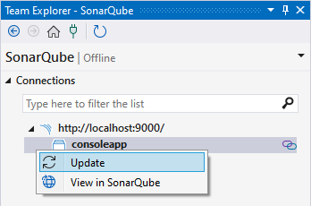

> ## ⓘ **Information**
>
>>**The content on this page has moved**: [**https://docs.sonarsource.com/sonarlint/visual-studio/previous-versions/**](https://docs.sonarsource.com/sonarlint/visual-studio/previous-versions/)  
>
>The SonarLint documentation has moved! Please visit [https://docs.sonarsource.com/sonarlint/visual-studio/](https://docs.sonarsource.com/sonarlint/visual-studio/) to have a look at the new documentation website. We’ve improved the documentation as a whole, integrated the four SonarLint IDE extension docs together, and moved everything under the sonarsource.com domain to share a home with the SonarQube docs (SonarCloud to come in Q3 of 2023).
>
>*These GitHub wikis will no longer be updated after October 1st, 2023* but no worries, we’ll keep them around a while for those running previous versions of SonarLint for Visual Studio.
>

# SonarLint for Visual Studio version 6.16 and earlier

## Connected Mode

### Synchronizing with the server

The local Connected Mode configuration files can sometimes get out of step with settings on the SonarQube or SonarCloud servers for example, when a quality profile for the project is changed (on the server).

When you open a bound solution in Visual Studio, SonarLint automatically checks if the server configuration has changed. If that’s the case, SonarLint will prompt you to update the local configuration.

### Updating a binding

In most cases, there should be no need to trigger a manual update on your Connected Mode binding to sync suppressed issues. However, changes made to the quality profile on the server will affect local files on your disc and those files might be under source control. Therefore, to sync changes from your quality profile, the Connected Mode binding must be updated from time to time.

To manually trigger an update to your Connected Mode binding, go Team Explorer > SonarQube, right-click the project whose binding you want to update, and click Update:

Note that [Retriving suppresed issues](https://github.com/SonarSource/sonarlint-visualstudio/wiki/Connected-Mode#retrieving-suppressed-issues-from-the-server) and working with [File exclusions](https://github.com/SonarSource/sonarlint-visualstudio/wiki/Connected-Mode#retrieving-file-exclusions-from-the-server) require a binding update to keep the SonarLint configuration in sync with SonarQube or SonarCloud. You can use the normal documentation to set these up but in v6.16 and earlier, the SonarLint settings file, saved in the local .sonarlint folder, may live under source control and therefore require extra precaution when updating the binding.

### Unbinding a project

It is not possible to unbind a project from the Visual Studio UI. See these to optionsinstructions to remove a solution from Connected Mode:

* For all languages except C# and VB: delete the .sonarlint folder that is located at the solution level.
* For C# and VB projects: additional steps are required. Because these languages use Visual Studio’s ruleset mechanism, binding a project modifies the project files, so you’ll need to remove the lines added when you bound the project. See [the special configuration details here](https://github.com/SonarSource/sonarlint-visualstudio/wiki/Connected-Mode-configuration-for--C%23-and-Visual-Basic-projects).

### Connected Mode configurations for C# and VB.NET projects

In version 6.16 and earlier, would save its .ruleset and SonarLint.xml files inside C# or VB.NET solution directories. Please see the [Connected Mode configuration page for C# and Visual Basic projects](https://github.com/SonarSource/sonarlint-visualstudio/wiki/Connected-Mode-configuration-for--C%23-and-Visual-Basic-projects) page to know how to set up Connected Mode with SonarQube or SonarCloud.

# SonarLint for Visual Studio version 3.10 and earlier

Before SonarLint for Visual Studio version 4.0 (released in May 2018), Connected Mode behaved a bit differently:

* The appropriate NuGet package for the `SonarAnalyzer.CSharp/SonarAnalyzer.VisualBasic` analyzers were added to each project.
* The Connected Mode settings were saved in a solution-level folder called SonarQube in a file called `SolutionBinding.sqconfig`.

In SonarLint for Visual Studio version 4.0 and later:

* The analyzer NuGet packages are no longer installed in any project
* The settings are saved in a solution-level folder called `.sonarlint` in a file called `[solution name].slconfig`.
