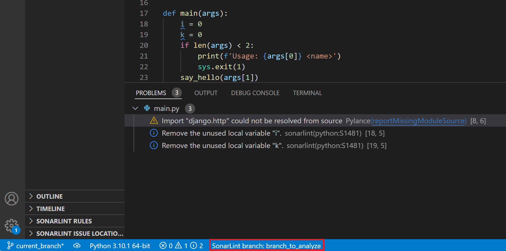

> ## ⓘ **Information**
>
>>**The content on this page has moved**: [**https://docs.sonarsource.com/sonarlint/vs-code/team-features/connected-mode/#branch-awareness**](https://docs.sonarsource.com/sonarlint/vs-code/team-features/connected-mode/#branch-awareness)  
>
>The SonarLint documentation has moved! Please visit [https://docs.sonarsource.com/sonarlint/vs-code/](https://docs.sonarsource.com/sonarlint/vs-code/) to have a look at the new documentation website. We’ve improved the documentation as a whole, integrated the four SonarLint IDE extension docs together, and moved everything under the sonarsource.com domain to share a home with the SonarQube docs (SonarCloud to come in Q3 of 2023).
>
>*These GitHub wikis will no longer be updated after September 1st, 2023* but no worries, we’ll keep them around a while for those running previous versions of SonarLint for VS Code.
>

# Overview

This feature will only work when SonarLint is connected to SonarCloud or to a SonarQube server.

In Connected Mode, SonarLint synchronizes some data from the issues that were found on the server side, most importantly the status and resolution.
Branch awareness allows SonarLint to consider the branch currently checked out in the IDE and synchronize with the most appropriate branch from the server.

Sonarlint shows the name of the branch that is used as reference for issues synchronized in the IDE's status bar. 
In the picture below, the checked-out git branch is named "current_branch", and the analyzed branch on the SonarQube server is named "branch_to_analyze".

# How SonarLint decide what branch to use for sync.

1. If the branch that is currently checked out locally was analyzed on the server, SonarLint will pick this branch for synchronization.
You commonly have a `master`|`main` branch analyzed on the server, so if you check out this branch locally, the reference branch will be the same. Important detail: branches with the same names are considered the same branch.
2. If the current branch was not analyzed, SonarLint will try to climb up on the git tree checking if the parent or grandparent branch was analyzed, all the way up to `master`. This case is illustrated in the picture above: `branch_to_analyze` was analyzed on the server, and it is the parent branch for `current_branch`.
3. All other cases will lead to defaulting to the branch marked as "main" on the server, either explicitly (displaying it on UI) or implicitly (without displaying Sonarlint branch UI at all). The latter can happen in case of errors related to local git repository access.

# How to check what branches are analyzed on server

In the project overview, click on the highlighted drop-down list, and you will see a list of analyzed branches and pull requests (see screenshot below for SonarQube).

# PR analysis synchronization

Currently, this feature does not support synchronization with pull request analysis.