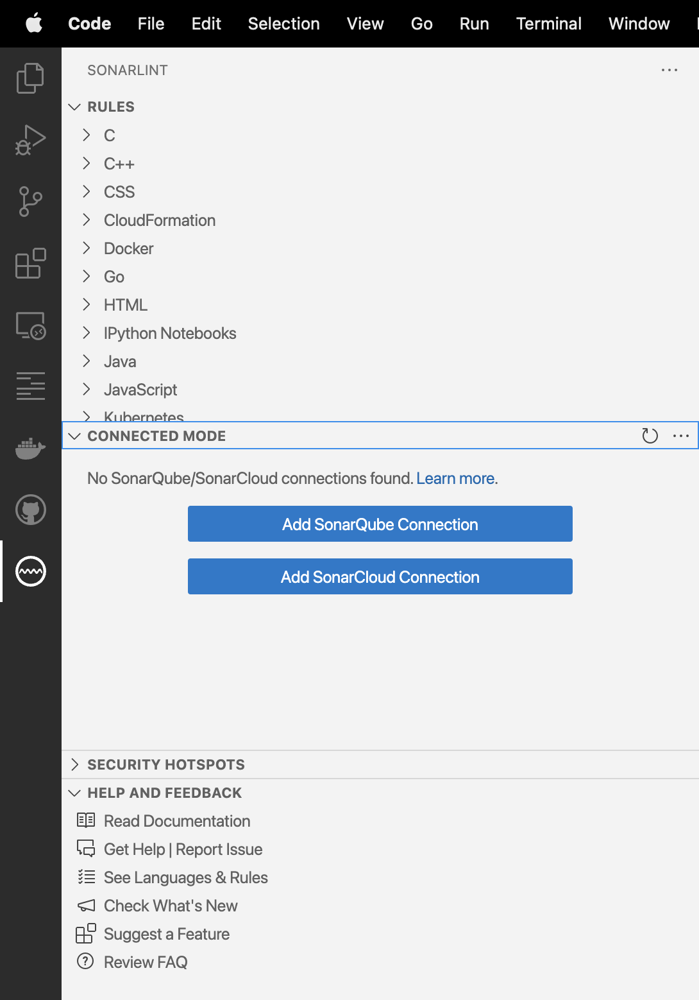
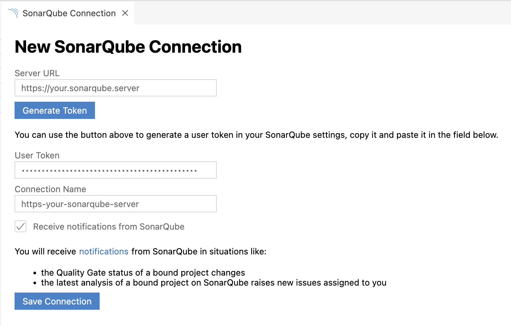
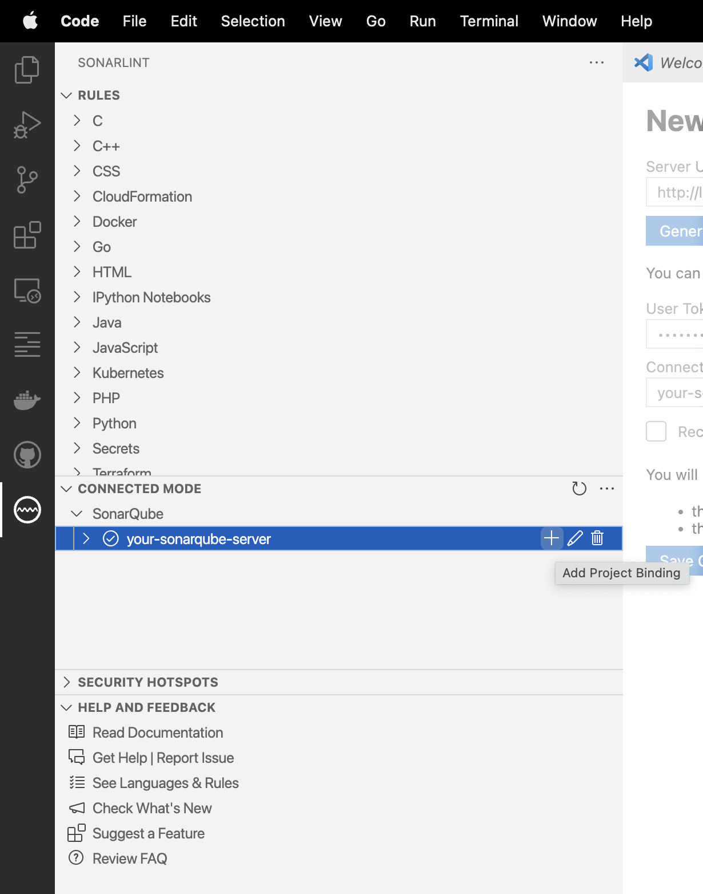
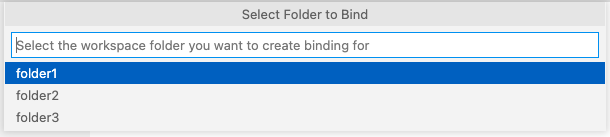
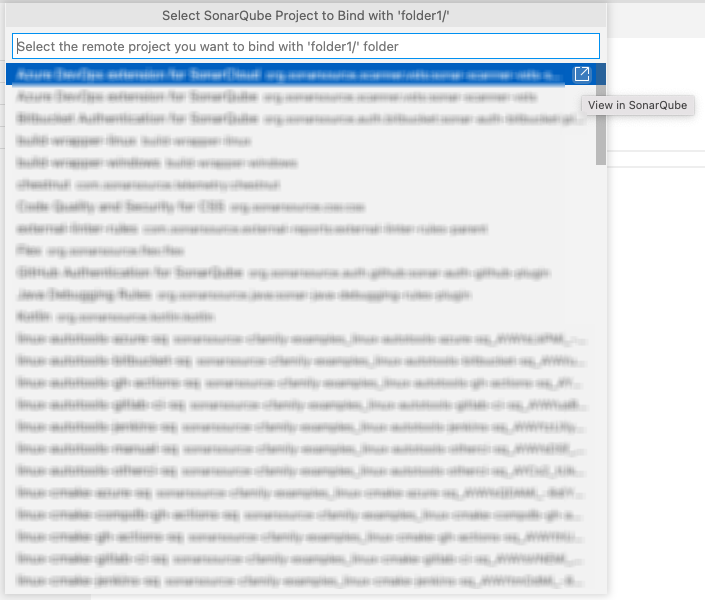
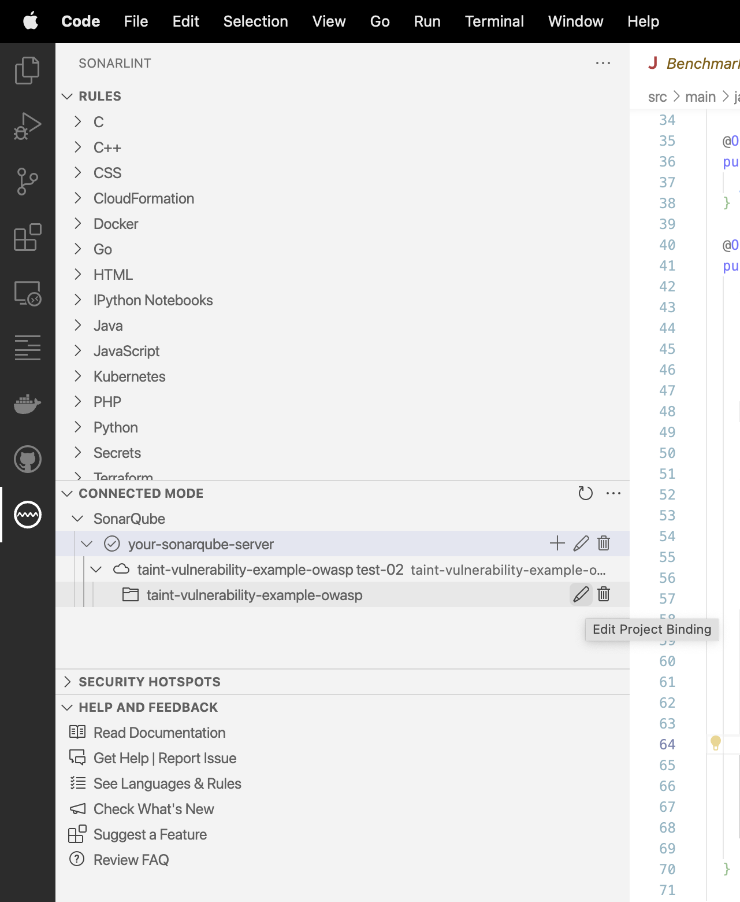

> ## ⓘ **Information**
>
>>**The content on this page has moved**: [**https://docs.sonarsource.com/sonarlint/vs-code/team-features/connected-mode/**](https://docs.sonarsource.com/sonarlint/vs-code/team-features/connected-mode/)  
>
>The SonarLint documentation has moved! Please visit [https://docs.sonarsource.com/sonarlint/vs-code/](https://docs.sonarsource.com/sonarlint/vs-code/) to have a look at the new documentation website. We’ve improved the documentation as a whole, integrated the four SonarLint IDE extension docs together, and moved everything under the sonarsource.com domain to share a home with the SonarQube docs (SonarCloud to come in Q3 of 2023).
>
>*These GitHub wikis will no longer be updated after September 1st, 2023* but no worries, we’ll keep them around a while for those running previous versions of SonarLint for VS Code.
>

# Overview 

You can connect SonarLint to SonarQube 7.9+/SonarCloud by binding your VSCode workspace folder to your SonarQube/SonarCloud project(s), and benefit from the same rules and settings that are used to inspect your project on the server. SonarLint in VSCode then hides **Won’t Fix** and **False Positive** issues in any file from a bound folder. In version 3.10 and above, SonarLint for VSCode tries to automatically detect the remote project to bind with your locally opened workspace folder.

While in Connected Mode, SonarLint receives notifications from SonarQube/SonarCloud about your Quality Gate changes and new issues. Notifications can be enabled or disabled from the UI while creating or editing the connection settings. Note, Connected Mode notifications are not available in SonarQube Community Edition 8.6 and earlier.

When running in Connected Mode with SonarQube 8.9 and above, and browsing a [security hotspot](https://docs.sonarqube.org/latest/user-guide/security-hotspots/), a button will be available offering to open the hotspot in SonarLint (with SonarLint already running in VSCode). Limitation: this feature relies on local communication between your web browser and SonarLint, and consequently is not available in some remote environments such as GitPod, or GitHub CodeSpaces.

Using Connected Mode with SonarQube or SonarCloud will also unlock analysis for these languages:

- [Apex rules](https://rules.sonarsource.com/apex)
- [COBOL rules](https://rules.sonarsource.com/cobol). See also the [COBOL language specific requirements](https://github.com/SonarSource/sonarlint-vscode/wiki/Languages-and-rules#cobol-analysis) for more information about this feature.
- [PL/SQL rules](https://rules.sonarsource.com/plsql)
- [Secrets](https://rules.sonarsource.com/secrets)

When configuring Connected Mode, follow the [Connection Setup instructions](https://github.com/SonarSource/sonarlint-vscode/wiki/Connected-Mode#connection-setup) below.

## Connection Setup

### SonarLint v3.8 and above

In v3.8 and above of SonarLint for VSCode, to set up SonarQube/SonarCloud connections, navigate to the **SONARLINT** > **CONNECTED MODE** view container in the VS Code **Activity Bar**.

Select either **Add SonarQube Connection** or **Add SonarCloud Connection**, and complete the fields.

For SonarQube connections, provide your SonarQube **Server URL** and **User Token**. For SonarCloud connections, provide your **Organization Key** and **User Token**. User Tokens should be generated on the SonarQube/SonarCloud side and pasted in the **User Token** field.

User Token can be generated using these pages:
* SonarQube - `https://<your-sonarqube-url>/account/security/`
* SonarCloud - `https://sonarcloud.io/account/security/`

**Connection Name** is a friendly name for your connections. In case of multiple connections, it also acts as a `connectionId`.

In SonarLint for VSCode v3.6 and above, notifications can be enabled or disabled here, or from the UI while creating or editing the connection setting (see next image below). Action buttons in the UI used to edit/delete existing, or create additional connections will be revealed when hovering over each connection.

Select **Save Connection** and verify that the new connection was set up successfully in the Connected Mode view.

### Project Binding v3.8 and above

From v3.10, SonarLint for VSCode tries to automatically detect a remote SonarQube/SonarCloud project to bind with the locally opened workspace folder. If the locally opened folder contains a `sonar-project.properties` or a `.sonarcloud.properties` file, SonarLint will try to configure the binding with the remote project defined in that configuration file.

If no remote match is found, you will be prompted to configure binding manually as we describe below.

To manually configure a project binding, open the **CONNECTED MODE** view and select **Add Project Binding** for the desired connection.

If your open workspace contains multiple folders, you will be prompted to choose a specific folder.

After selecting the folder, choose the remote SonarQube/SonarCloud project you would like to bind.

Select the desired project and enjoy Connected Mode! You can also edit or delete bindings from the **CONNECTED MODE** view.

Action buttons in the UI used to edit/delete existing or create additional connections, will be revealed when hovering over each connection.

### SonarLint v3.7 and earlier

Please see [Connected Mode Setup for previous versions](https://github.com/SonarSource/sonarlint-vscode/wiki/Previous-versions#connected-mode-setup-for-previous-versions) to read the documentation about activating Connected Mode in earlier releases of SonarLint for VSCode.
__________________________________

### Project Binding
SonarLint keeps server-side data in local storage. If you change something on the server such as the Quality Profile, SonarLint will automatically attempt to synchronize with configured servers at startup and once every hour and will do its best to [synchronize with the most appropriate branch from the server](https://github.com/SonarSource/sonarlint-vscode/wiki/Branches-awareness). Additionally, you can trigger an update of the local storage using the "SonarLint: Update all project bindings to SonarQube/SonarCloud" command on the command palette (search for "sonarlint"). 

---
