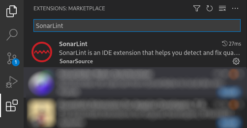
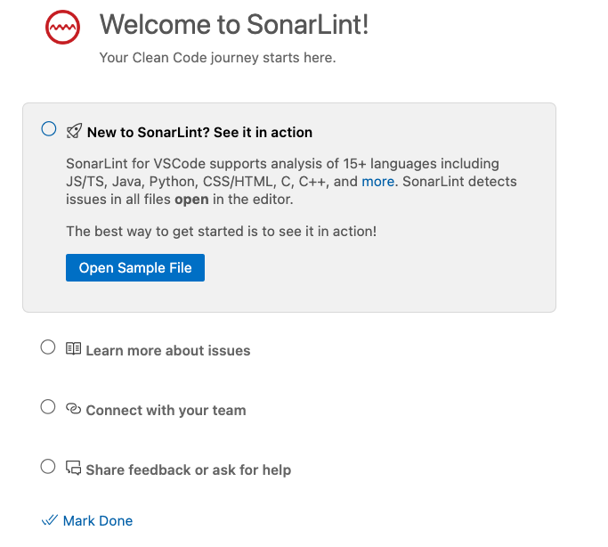
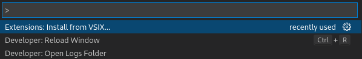

> ## ⓘ **Information**
>
>>**The content on this page has moved**: [**https://docs.sonarsource.com/sonarlint/vs-code/getting-started/installation/**](https://docs.sonarsource.com/sonarlint/vs-code/getting-started/installation/)  
>
>The SonarLint documentation has moved! Please visit [https://docs.sonarsource.com/sonarlint/vs-code/](https://docs.sonarsource.com/sonarlint/vs-code/) to have a look at the new documentation website. We’ve improved the documentation as a whole, integrated the four SonarLint IDE extension docs together, and moved everything under the sonarsource.com domain to share a home with the SonarQube docs (SonarCloud to come in Q3 of 2023).
>
>*These GitHub wikis will no longer be updated after September 1st, 2023* but no worries, we’ll keep them around a while for those running previous versions of SonarLint for VS Code.
>

# Installation

The easiest way to install the SonarLint extension is to search the Visual Studio Code Marketplace, directly from the IDE. 

Select the **Extensions** icon in the Activity Bar and search for `SonarLint`:

   

Next, select **Install**. SonarLint should start right away after the installation is complete.

You can now enjoy SonarLint!

## First tase of SonarLint

Now that you have SonarLint installed, open or create a new project containing source files in a programming language SonarLint can analyze out of the box. See the [Languages and Rules](https://github.com/SonarSource/sonarlint-vscode/wiki/Languages-and-rules) page for languages that work with your IDE.

SonarLint for VS Code 3.20+ introduces a **walkthrough** to help you make the best out of it SonarLint. The walkthrough covers the basic features to help you:

- see issues in your code.
- learn more about those issues and fix them.
- synchronize the analysis configuration with other contributors.
- diagnose problems and share feedback with the SonarLint team.

The walkthrough will be automatically displayed when you install SonarLint for the first time, and you can manually open it anytime from the command palette: search **Welcome Open Walkthrough…**, then select **Welcome to SonarLint!** to have a look!

## Offline installation

In case you want to install SonarLint offline, you need to first get access to SonarLint's VSIX file.

You can download official versions on the [Marketplace](https://marketplace.visualstudio.com/items?itemName=SonarSource.sonarlint-vscode), from the "Version History" tab. Sometimes an ad-hoc version can be built mainly for debugging purposes when a user reports a bug on the Sonar Community forum.

To install the extension, use the dedicated command `Extensions: Install from VSIX...` in the palette. Select the VSIX file in the explorer and install it.

   
