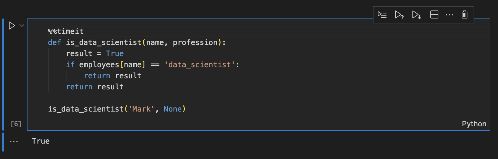
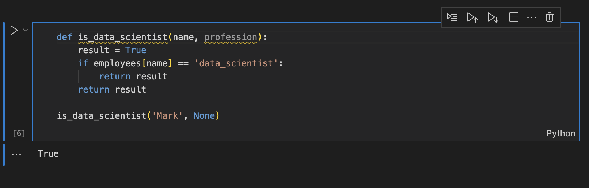

> ## ⓘ **Information**
>
>>**The content on this page has moved**: [**https://docs.sonarsource.com/sonarlint/vs-code/using-sonarlint/scan-my-project/#jupyter-notebooks**](https://docs.sonarsource.com/sonarlint/vs-code/using-sonarlint/scan-my-project/#jupyter-notebooks)  
>
>The SonarLint documentation has moved! Please visit [https://docs.sonarsource.com/sonarlint/vs-code/](https://docs.sonarsource.com/sonarlint/vs-code/) to have a look at the new documentation website. We’ve improved the documentation as a whole, integrated the four SonarLint IDE extension docs together, and moved everything under the sonarsource.com domain to share a home with the SonarQube docs (SonarCloud to come in Q3 of 2023).
>
>*These GitHub wikis will no longer be updated after September 1st, 2023* but no worries, we’ll keep them around a while for those running previous versions of SonarLint for VS Code.
>

# Overview

SonarLint for VS Code v3.16+ supports analysis of Python code inside Jupyter notebooks. When opening an `.ipynb` file, SonarLint analyzes the Python code and Python cells inside your Jupyter Notebooks. 

There is nothing special to do to run a SonarLint analysis; simply open a Jupyter Notebook file. As with any Jupyter Notebook, you must set up your [VS Code environment](https://code.visualstudio.com/docs/datascience/jupyter-notebooks#_setting-up-your-environment) to run a project. The usual Quick Fix and issue investigation options you are accustomed to are available.

### Managing rules
IPython Notebooks is a new rules category in the SonarLint explorer. Go to **SONARLINT RULES** > **IPython Notebooks** in the **SonarLint view container** to enable/disable rules, just as you would any rule for other languages.

The following rules have been disabled by default for Jupyter documents becuase they tend to be noisy in the notebook environment:
- [ipython:S905](https://rules.sonarsource.com/python/RSPEC-905), [ipython:S1481](https://rules.sonarsource.com/python/RSPEC-1481), [ipython:S2201](https://rules.sonarsource.com/python/RSPEC-2201), [ipython:S5754](https://rules.sonarsource.com/python/RSPEC-5754)

### Connected Mode
Connected Mode will be ignored when working with Jupyter Notebooks. You will only have local analysis; this is because analysis of Jupyter Notebooks is not yet supported by SonarQube or SonarCloud.

## Magic commands
All Magic commands are ignored by SonarLint (for example, `%matplotlib inline` and `%%timeit`). 
When a line magic command is found, that line will be ignored. Similarily, when a cell magic command is found, the entire cell will be ignored. The next image below shows a normal Jupyter cell; the second image illustrates the same cell with a cell magic command. Note how SonarLint ignores issues in the cell with the magic command.

Image: *SonarLint with a cell magic command*.

Image: *SonarLint without a cell magic command*.
