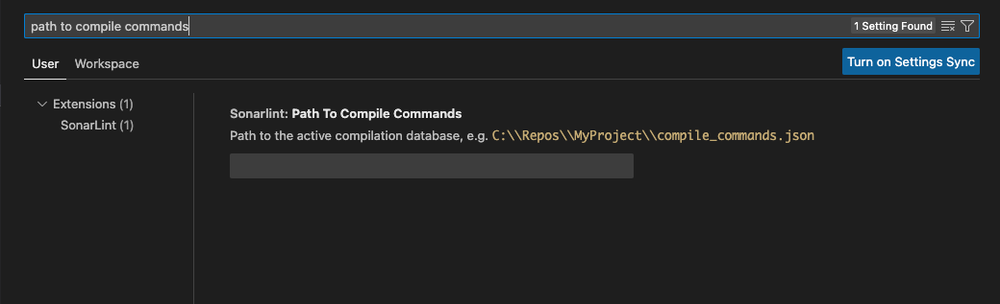
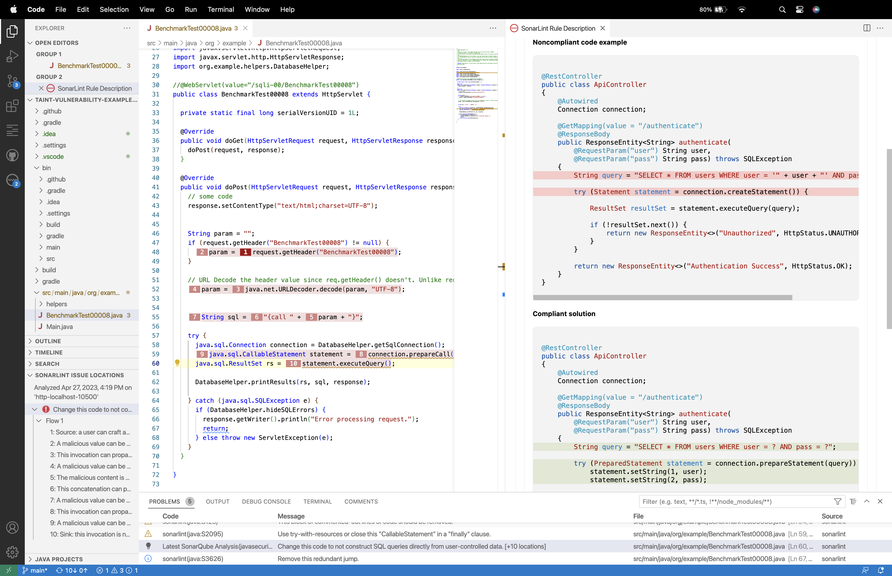

> ## ⓘ **Information**
>
>>**The content on this page has moved**: [**https://docs.sonarsource.com/sonarlint/vs-code/using-sonarlint/rules/**](https://docs.sonarsource.com/sonarlint/vs-code/using-sonarlint/rules/)  
>
>The SonarLint documentation has moved! Please visit [https://docs.sonarsource.com/sonarlint/vs-code/](https://docs.sonarsource.com/sonarlint/vs-code/) to have a look at the new documentation website. We’ve improved the documentation as a whole, integrated the four SonarLint IDE extension docs together, and moved everything under the sonarsource.com domain to share a home with the SonarQube docs (SonarCloud to come in Q3 of 2023).
>
>*These GitHub wikis will no longer be updated after September 1st, 2023* but no worries, we’ll keep them around a while for those running previous versions of SonarLint for VS Code.
>

# Overview

Out of the box, SonarLint automatically checks your code against the following rules:

- [C rules](https://rules.sonarsource.com/c)
- [C++ rules](https://rules.sonarsource.com/cpp)
- [Cloud formation](https://rules.sonarsource.com/cloudformation)
- [CSS rules](https://rules.sonarsource.com/css)
- [Docker](https://rules.sonarsource.com/docker)
- [Go rules](https://rules.sonarsource.com/go)
- [HTML rules](https://rules.sonarsource.com/html)
- [Java rules](https://rules.sonarsource.com/java)
- [JavaScript rules](https://rules.sonarsource.com/javascript)
- [Kubernetes](https://rules.sonarsource.com/kubernetes)
- [Python and IPython notebook rules](https://rules.sonarsource.com/python)
- [PHP rules](https://rules.sonarsource.com/php)
- [Secrets rules](https://rules.sonarsource.com/secrets)
- [Terraform](https://rules.sonarsource.com/terraform)
- [TypeScript rules](https://rules.sonarsource.com/typescript)

In addition, SonarLint for VS Code supports the following analysis when running in [Connected Mode](https://github.com/SonarSource/sonarlint-vscode/wiki/Connected-mode).

- [Apex rules](https://rules.sonarsource.com/apex) See [below for more details](#apex-analysis).
- [COBOL rules](https://rules.sonarsource.com/cobol). See also the [COBOL Analysis specific requirements](#cobol-analysis) below for more information about this feature.
- [PL/SQL rules](https://rules.sonarsource.com/plsql) See [below for more details](#plsql-analysis).
- [Secrets detection](https://rules.sonarsource.com/secrets) See [below for more details](#secrets-detection).

The full list of available rules is visible in the **SONARLINT RULES** view of the SonarLint view container, where you can activate and deactivate rules to match your conventions. SonarLint will also show a code action on each issue to quickly deactivate the corresponding rule.

## Requirements

The SonarLint language server requires a Java Runtime (JRE) 11+.

On the following platforms, SonarLint comes with its own Java runtime:
- Windows x86-64
- Linux x86-64
- macOS x86-64 (Intel Macs) and arm-64 (Apple Silicon Macs)

On other platforms and if a Java runtime is already installed on your computer, SonarLint should automatically find and use it. Here is how SonarLint will search for an installed JRE (in priority order):

1. the `sonarlint.ls.javaHome` variable in VS Code settings if set. For instance:

    {
        "sonarlint.ls.javaHome": "C:\\Program Files\\Java\\jre-11.0.11"
    }
2. embedded JRE for platform-specific installations
3. the value of the `JDK_HOME` environment variable if set
4. the value of the `JAVA_HOME` environment variable if set
5. on Windows the registry is queried
6. if a JRE is still not found then:
   1. the `PATH` is scanned for `javac`
   2. on macOS, the parent directory of `javac` is checked for a `java_home` binary. If that binary exists then it is executed and the result is used
   3. the grandparent directory of `javac` is used. This is similar to `$(dirname $(dirname $(readlink $(which javac))))`

SonarLint then uses the first JRE found in these steps to check its version.

If a suitable JRE cannot be found at those places, SonarLint will ask for your permission to download and manage its own version.

## Language specific requirements

### Apex analysis

The support for Apex analysis is only available together with SonarQube Enterprise Edition or SonarCloud when running in [Connected Mode](https://github.com/SonarSource/sonarlint-vscode/wiki/Connected-mode). You will also need the [Salesforce Extension Pack](https://marketplace.visualstudio.com/items?itemName=salesforce.salesforcedx-vscode) VS Code extension.

### C and C++ analysis specific requirements

To analyze C and C++ code, SonarLint requires that you define a path to your compile commands. 

Search for **Path To Compile Commands** in the **VS Code Settings** (or go to **VS Code Settings** > **Extensions** > **SonarLint** > **User** and scroll to the entry); then enter the full path to your active compilation database:



Note: if you are using *Microsoft Visual C++ compiler*, the environment should be ready to build the code. For example, by launching VS Code from your Visual Studio Command Prompt.

More information about supported environments and troubleshooting tips can be found on the [C and CPP analysis](https://github.com/SonarSource/sonarlint-vscode/wiki/C-and-cpp-analysis) page.

### COBOL analysis

COBOL analysis is a feature available in SonarLint for VS Code v3.19+ only when running in Connected Mode with SonarQube Enterprise edition+ or SonarCloud. In addition, the VS Code Language Mode must be set to COBOL independent of your file type. If your extension doesn’t set the language automatically, please see the [VS Code documentation](https://code.visualstudio.com/docs/languages/overview#_change-the-language-for-the-selected-file) to learn how to manually change the language for the selected file.

By default, SonarLint takes the analysis configuration from the SonarQube or SonarCloud server therefore it is required that your project has _already been analyzed by SonarQube or SonarCloud_. The following COBOL analyzer properties are synced by default unless previously overridden locally. Note that all properties found on the server will be synced locally, not just this selection:

* `sonar.cobol.dialect`
* `sonar.cobol.file.suffixes`
* `sonar.cobol.sourceFormat`
* `sonar.cobol.copy.suffixes`
* `sonar.cobol.copy.directories`

In case copybooks are in different location locally, the analyzer property `sonar.cobol.copy.directories` should be defined in the `/project/.vscode/settings.json` file.

If working with COBOL files via Zowe explorer, it is recommended to update your Zowe workspace settings in VS Code by[ modifying the temporary file location](https://docs.zowe.org/stable/user-guide/ze-install/#modifying-temporary-file-location-settings); temporary files should be saved to your project folder which is bound to SonarQube or SonarCloud. With the correct configuration, the analysis will be executed normally and you should see detected problems.

### Infrastructure as Code

SonarLint for VS Code 3.17+ supports analysis of Infrastructure as Code (IaC) to help you secure your deployments. See the Sonar Rules pages as linked below for complete details:

- [CloudFormation](https://rules.sonarsource.com/cloudformation)
- [Docker](https://rules.sonarsource.com/docker)
- [Kubernetes](https://rules.sonarsource.com/kubernetes)
- [Terraform](https://rules.sonarsource.com/terraform)

### Java analysis

To enable the support for Java analysis, you need the [Language support for Java](https://marketplace.visualstudio.com/items?itemName=redhat.java) VSCode extension (version 0.56.0 or higher). You also need to be in [standard mode](https://code.visualstudio.com/docs/java/java-project#_lightweight-mode).

### JS/TS analysis

To analyze JavaScript and TypeScript code, SonarLint requires Node.js executable. The minimal supported version is `14.17.0` for standalone analysis or in Connected Mode with SonarCloud. For Connected Mode with SonarQube, it depends on the version of the JS/TS analyzer on your SonarQube server. SonarLint will attempt to automatically locate node, or you can force the location using:

```json
    {
        "sonarlint.pathToNodeExecutable": "/home/yourname/.nvm/versions/node/v14.17.0/bin/node"
    }
```

Analysis of TypeScript in Connected Mode with SonarQube requires the server to use version 8.1 or above.

### Jupyter notebooks
SonarLint for VS Code v3.16+ supports analysis of Python code inside Jupyter notebooks. See the [documentation](https://github.com/SonarSource/sonarlint-vscode/wiki/Jupyter-notebooks) page for details.

### PL/SQL analysis

The support for PL/SQL analysis is only available together with SonarQube Developer Edition or SonarCloud when running in [Connected Mode](https://github.com/SonarSource/sonarlint-vscode/wiki/Connected-mode). You also need the [Oracle Developer Tools for VSCode](https://marketplace.visualstudio.com/items?itemName=Oracle.oracledevtools) VS Code extension.

## Additional requirements

### Injection vulnerabilities

Security vulnerabilities requiring taint engine analysis (taint vulnerabilities) are only available in Connected Mode because SonarLint pulls them from SonarQube or SonarCloud following a project analysis.

To browse injection vulnerabilities in SonarLint for VSCode, establish [Connected Mode](https://github.com/SonarSource/sonarlint-vscode/wiki/Connected-mode) with your SonarQube Developer Edition (and above) or SonarCloud instance. Once a [Project Binding](https://github.com/SonarSource/sonarlint-vscode#project-binding) is configured, SonarLint will synchronize with the SonarQube or SonarCloud server to report the detected injection vulnerabilities.

More information about security-related rules are available in the [SonarQube](https://docs.sonarqube.org/latest/user-guide/security-rules/) or [SonarCloud](https://docs.sonarcloud.io/digging-deeper/security-related-rules/) documentation.

### Security hotspots
In SonarLint for VS Code 3.14 and above, local detection of [Security Hotspots](https://docs.sonarqube.org/latest/user-guide/security-hotspots/) is enabled if you are using [Connected Mode](https://github.com/SonarSource/sonarlint-vscode/wiki/Connected-Mode) with SonarQube 9.7 or above.

Please see the [documentation](https://github.com/SonarSource/sonarlint-vscode/wiki/Security-hotspots) for more details. 

### Secrets detection
Secrets are pieces of user-specific or system-level credentials that should be protected and accessible to legitimate users only. SonarLint detects exposed Secrets in your source code and language agnostic config files. When running in Connected Mode, the SonarQube or SonarCloud Quality Profiles are applied to locally detected Secrets.

## Sonar Rule Descriptions

Simply right-click an issue in the **PROBLEMS** Panel, and choose **SonarLint: Open description of rule `...`** to open the **SonarLint Rule Description** Webview. Here you will find a brief explanation of the rule, along with a noncompliant and compliant code example.

For some **SonarLint Rule Descriptions**, you are able to visualize a diff view for the noncompliant and compliant code sample which should help you fix your issue.

