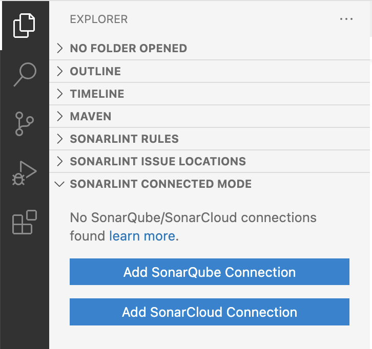
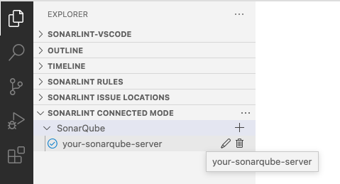

> ## ⓘ **Information**
>
>>**The content on this page has moved**: [**https://docs.sonarsource.com/sonarlint/vs-code/previous-versions/**](https://docs.sonarsource.com/sonarlint/vs-code/previous-versions/)  
>
>The SonarLint documentation has moved! Please visit [https://docs.sonarsource.com/sonarlint/vs-code/](https://docs.sonarsource.com/sonarlint/vs-code/) to have a look at the new documentation website. We’ve improved the documentation as a whole, integrated the four SonarLint IDE extension docs together, and moved everything under the sonarsource.com domain to share a home with the SonarQube docs (SonarCloud to come in Q3 of 2023).
>
>*These GitHub wikis will no longer be updated after September 1st, 2023* but no worries, we’ll keep them around a while for those running previous versions of SonarLint for VS Code.
>

# Overview

This page contains information specific to previous versions of SonarLint

## Connected Mode Setup for previous versions

### SonarLint v3.6-v3.7

Starting from v3.6 of SonarLint for VSCode, to set up SonarQube/SonarCloud connections, open a **SONARLINT CONNECTED MODE** view in VSCode.

Select either **Add SonarQube Connection** or **Add SonarCloud Connection**, and complete the fields.

For SonarQube connections, provide your **SonarQube Server URL** and **User Token**. For SonarCloud connections, provide your **Organization Key** and **User Token**. User Tokens should be generated on the SonarQube/SonarCloud side and pasted into the **User Token field**.

User Tokens can be generated using these pages:
* SonarQube - `https://<your-sonarqube-url>/account/security/`
* SonarCloud - `https://sonarcloud.io/account/security/`

**Connection Name** is a friendly name for your connections. In the case of multiple connections, it also acts as a `connectionId`.

SonarLint for VSCode v3.6 and above has the option to enable/disable **Receive notifications** when starting a new connection. Notifications can also be enabled/disabled from the UI while editing the connection setting (see next image below). Action buttons used to edit/delete existing, or create additional connections will be revealed in the UI when hovering over each connection.

Select **Save Connection** and verify that the new connection was set up successfully in the Connected Mode view.

Action buttons to edit/delete existing, or create additional connections will be revealed when hovering over each connection. 

### Project Binding v3.6-3.7

Establish your SONARLINT CONNECTED MODE as described [above](Connected-Mode#sonarlint-v36-v37).

Project Bindings can be configured either at the workspace level or in every workspace folder by modifying the `settings.json` file. Example:

    {
        "sonarlint.connectedMode.project": {
            "projectKey": "the-project-key"
        }
    }

If you plan to use multiple connections to different SonarQube servers and/or SonarCloud organizations, simply give a unique `connectionId` to each entry and use them as reference in the binding. Example:

    // In project1/.vscode/settings.json
    {
        "sonarlint.connectedMode.project": {
            "connectionId": "mySonar",
            "projectKey": "the-project-key-on-sq"
        }
    }

    // In project2/.vscode/settings.json
    {
        "sonarlint.connectedMode.project": {
            "connectionId": "myOrgOnSonarCloud",
            "projectKey": "the-project-key-on-sc"
        }
    }

__________________________________
### SonarLint Versions 3.5.4 and Lower

Connection details should be configured in the VSCode user settings (user token, SonarQube server URL, or SonarCloud organization). For security reasons, the token should not be stored in SCM with workspace settings (why we suggest configuring in VSCode user settings).

Example for SonarQube:

    {
        "sonarlint.connectedMode.connections.sonarqube": [
            { "serverUrl": "https://sonarqube.mycompany.com", "token": "<generated from SonarQube account/security page>" }
        ]
    }

Example for SonarCloud:

    {
        "sonarlint.connectedMode.connections.sonarcloud": [
            { "organizationKey": "myOrg", "token": "<generated from https://sonarcloud.io/account/security/>" }
        ]
    }

Notifications from your project's Quality Gate can be toggled using the `disableNotifications` field in a server connection definition.

### Project Binding v3.5.4 and Lower

SonarLint v3.5.4 and earlier allows bindings either at the workspace level, or at each workspace folder. Example:

    {
        "sonarlint.connectedMode.project": {
            "projectKey": "the-project-key"
        }
    }

If you plan to use multiple connections, to different SonarQube servers and/or SonarCloud organizations, simply give a unique `connectionId` to each entry, and use them as reference in the binding. Example:

    // In user settings
    {
        "sonarlint.connectedMode.connections.sonarqube": [
            { "connectionId": "mySonar", "serverUrl": "https://sonarqube.mycompany.com", "token": "xxx" }
        ]
        "sonarlint.connectedMode.connections.sonarcloud": [
            { "connectionId": "myOrgOnSonarCloud", "organizationKey": "myOrg", "token": "yyy" }
        ]
    }

    // In project1/.vscode/settings.json
    {
        "sonarlint.connectedMode.project": {
            "connectionId": "mySonar",
            "projectKey": "the-project-key-on-sq"
        }
    }

    // In project2/.vscode/settings.json
    {
        "sonarlint.connectedMode.project": {
            "connectionId": "myOrgOnSonarCloud",
            "projectKey": "the-project-key-on-sc"
        }
    }

