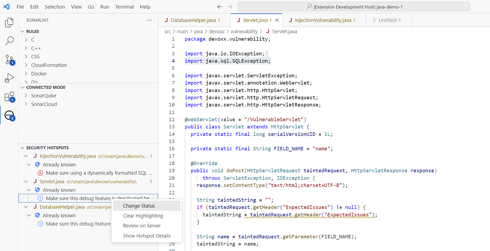
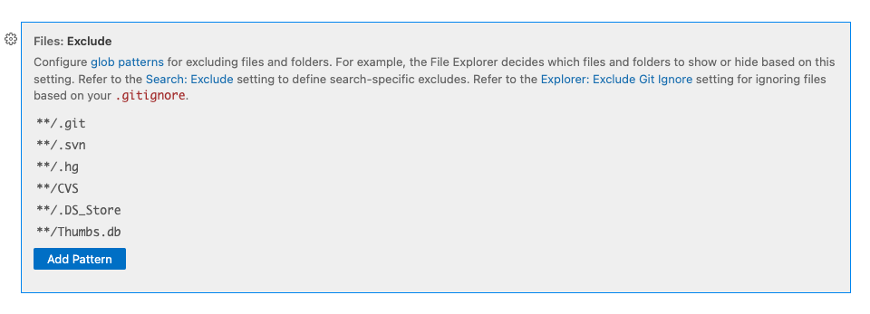

> ## ⓘ **Information**
>
>>**The content on this page has moved**: [**https://docs.sonarsource.com/sonarlint/vs-code/using-sonarlint/security-hotspots/**](https://docs.sonarsource.com/sonarlint/vs-code/using-sonarlint/security-hotspots/)  
>
>The SonarLint documentation has moved! Please visit [https://docs.sonarsource.com/sonarlint/vs-code/](https://docs.sonarsource.com/sonarlint/vs-code/) to have a look at the new documentation website. We’ve improved the documentation as a whole, integrated the four SonarLint IDE extension docs together, and moved everything under the sonarsource.com domain to share a home with the SonarQube docs (SonarCloud to come in Q3 of 2023).
>
>*These GitHub wikis will no longer be updated after September 1st, 2023* but no worries, we’ll keep them around a while for those running previous versions of SonarLint for VS Code.
>

# Overview

A security hotspot highlights a security-sensitive piece of code that the developer needs to review. Upon review, you'll either find there is no threat or you need to apply a fix to secure the code. For more information about Security Hotspots, take a look at the [SonarQube](https://docs.sonarqube.org/latest/user-guide/security-hotspots/) and [SonarCloud](https://docs.sonarcloud.io/digging-deeper/security-hotspots/) documentation.
  
In SonarLint for VS Code 3.14 and above, local detection of [Security Hotspots](https://docs.sonarqube.org/latest/user-guide/security-hotspots/) is enabled if you are using [Connected Mode](https://github.com/SonarSource/sonarlint-vscode/wiki/Connected-Mode) with a project on SonarQube 9.7 or above; from SonarLint version 3.18+, [Security Hotspots](https://docs.sonarcloud.io/digging-deeper/security-hotspots/) are also found when bound to a project in SonarCloud. ​These issue types are shown under the **SECURITY HOTSPOTS** view located in the SonarLint View Container and are grouped by file.
Security hotspots are shown under the **SECURITY HOTSPOTS** view located in the **SonarLint View Container** and are grouped by file.

## Reviewing hotspots

First, open a file while your project is running in Connected Mode with SonarQube 9.7+ or SonarCloud. SonarLint will automatically run an analysis to look for Security hotspots, then compares local results against those on the SonarQube server. The Security hotspot results will be automatically grouped by file and labeled as _Newly detected_ or _Already known_. 

Clicking on an issue in either category highlights the code in the explorer window. 

### Newly detected hotspots
_Newly detected_ security hotspots are those found during the analysis and exist only locally. _Newly detected_ hotspots can be fixed by modifying your code or by submitting your code to trigger a new analysis in SonarQube where you can mark it as **Fixed** or **Safe** on the server.

Right-clicking on a _Newly detected_ hotspot reveals 2 options to select:
- **Clear Highlighting** to remove the highlight over your code in the explorer window.
- **Show Rule Description** to open the rule in the SonarLint view window.

### Already known hotspots
Once the security hotspot analysis is complete, SonarLint will compare the local results against those found on the SonarQube server and sort them accordingly. _Already known_ security hotspots are those that exist locally _and_ in SonarQube. _Already known_ hotspots can be fixed by modifying your code in the IDE, or you can mark it as **Fixed** or **Safe** on the server.

Right-clicking on an _Already known_ hotspot gives you these 3 options to select:
- **Change Status** to modify the status of a known hotspot.
- **Clear Highlighting** to remove the highlight over your code in the explorer window.
- **Review on Server** to open the hotspot in SonarQube where you can mark it as **Fixed** or **Safe**.
- **Show Hotspot Details** will open the details view and provide information about the rule and the current status of the hotspot.

## Reporting security hotspots In the Whole Folder

By default, SonarLint will search for Security Hotspots only in open files each time an analysis is triggered; the use of Connected Mode is required. To activate an analysis for security hotspots in your entire project, select **In Whole Folder** from the **SONARLINT SECURITY HOTSPOTS** view container.

When selecting **In Whole Folder**, a scan of your entire project will be made. Switching back to **In Open Files** will filter the results to files open in the code editor. Each time you select **In Whole Folder**, a new analysis will be triggered on the entire project.

Using the **In Whole Folder** feature may consume excessive resources depending on the size of your project. If your project is too large, a notice will appear to confirm the action. Therefore, it is recommended that users define a set of file exclusions when analyzing large projects with the **In Whole Folder** feature. SonarLint integrates some file exclusions automatically and VS Code can help configure additional exclusions to help manage your analysis.

SonarLint will deploy these file exclusions automatically:
- **File extension**: SonarLint knows the primary language of your project and will restrict the scope of analysis to files matching that set of extensions.
- **File size**: Files larger than 0.5 Mb will be ignored…
- **.gitignore**: Exclusions added to your .gitignore file will be excluded.

**NOTE**: Although .gitignore files are excluded from analysis by default, git offers little transparency and the analyzer cannot investigate further when there is an error. Therefore, it is recommended that you use the VS Code exclusions to supplement what’s defined in your .gitignore file.

### Defining file exclusions

To use VS Code’s file exclusions, go to VS Code **Settings** > **Workspace**, search File: **Exclude** and select **Add Pattern**. The **Workspace** setting has information about how VS Code uses globbing patterns to manage exclusions in the editor.

### Using wildcards

To match any folder/directory plus the file extension with any prefix before it, use the following wildcards:
- `*` Match zero or more characters (not including the directory delimiter, /).
- `**` Match zero or more directory segments within the path.
- `?` Match a single character (not including the directory delimiter, /).

Check the [SonarQube](https://docs.sonarqube.org/latest/project-administration/narrowing-the-focus/#wildcard-patterns) or [SonarCloud](https://docs.sonarcloud.io/advanced-setup/analysis-scope/#wildcard-patterns) documentation about defining your analysis scope to see examples using wildcard patterns for file exclusion. Note that SonarLint *does not consider test file patterns for exclusion*; you should follow the VS Code guidelines above to define your exclusions for large projects.

### Fixing hotspots

How you fix a security hotspot depends on your assessment of the risk. Check the Rule description and the How can I fix it? tab to find recommended secure coding practices and compliant solutions (when available). More information can be found in the [SonarQube](https://docs.sonarqube.org/latest/user-guide/security-hotspots/#workflow) and [SonarCloud](https://docs.sonarcloud.io/digging-deeper/security-hotspots/#workflow) documentation.

Once you determine the risk, you can either update your code locally, or if the hotspot matches one found on the server, change the hotspot’s review status in the IDE from To Review to Fixed, or Safe. Prerequisites to change the review status in the IDE are:
* The security hotspot detected locally is already known by SonarQube or SonarCloud.
* You are granted the Administer Security Hotspot permission level by a project administrator.

Simply right-click the hotspot in the SECURITY HOTSPOTS view to select Change Status; from there a wizard will open to help you mark it as To review, Fixed, or Safe from the IDE. Next time your project binding syncs with the server, your status update will be reflected in SonarQube or SonarCloud.
