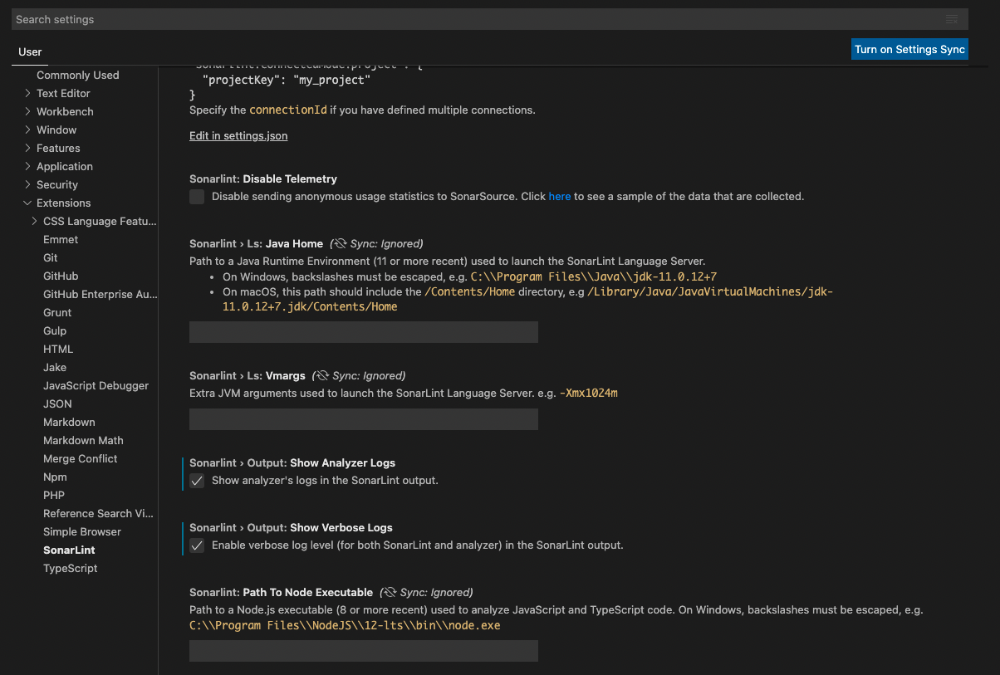
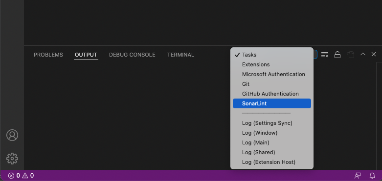

> ## ⓘ **Information**
>
>>**The content on this page has moved**: [**https://docs.sonarsource.com/sonarlint/vs-code/troubleshooting/**](https://docs.sonarsource.com/sonarlint/vs-code/troubleshooting/)  
>
>The SonarLint documentation has moved! Please visit [https://docs.sonarsource.com/sonarlint/vs-code/](https://docs.sonarsource.com/sonarlint/vs-code/) to have a look at the new documentation website. We’ve improved the documentation as a whole, integrated the four SonarLint IDE extension docs together, and moved everything under the sonarsource.com domain to share a home with the SonarQube docs (SonarCloud to come in Q3 of 2023).
>
>*These GitHub wikis will no longer be updated after September 1st, 2023* but no worries, we’ll keep them around a while for those running previous versions of SonarLint for VS Code.
>

## How to get SonarLint for VSCode logs?

1. Open the _SonarLint extension_ settings: **Manage** > **Settings** > **Extensions** > **SonarLint**
2. Enable the **Show Verbose Logs** and select the **Show Analyzer Logs** options in the extension settings.

   
3. Switch the output in the VSCode console: **Output** > **SonarLint**

   
